# Tæki og tól

## Upplýsingar og ítarefni um tækjabúnað smiðjunnar

## Epilog laser 40W

### Stillingar fyrir Epilog laser mini 40W

!!! Danger "Varúðarráðstafanir fyrir Epilog laser 40W"
    
    **Munið að aldrei má yfirgefa laserskurðarvélina á meðan hún vinnur vegna eldhættu.**
    
    **Munið að kveikja alltaf á loftpressunni þegar laserskorið er í vélinni.** Það kælir skurðarsvæðið og dregur úr eldhættu.

    **Munið að kveikja alltaf á frásogi frá vélinni áður en verkefni er sett í gang.** 

    **Hafið á hreinu hvernig á að bregðast við ef eldur kemur upp:**

    * Lítill logi: Notið vatnsúðabrúsa, sem staðsettur er við hlið vélarinnar, og úðið á logann.
    * Eldur logar: Notið kolsýruslökkvitæki til að slökkva eldinn. Ekki hika við að kveikja á brunaviðvörunarkerfinu og hringja í 112 ef þið ráðið ekki strax við aðstæður.

!!! Warning "Efni sem ekki má nota í Epilog laser"
    
    Það má aldrei skera PVC, nylon eða vínyl í lasernum.

!!! success "Yfirlit yfir helstu stillingar í Epilog laser 40W"
    
    Hér má finna samantekt á stillingum fyrir laserskurð og rasteringu í Epilog laser mini 40W. Athugið að fara vel yfir stillingar áður en verkefni er sett af stað. Lesið yfir varúðarráðstafanir áður en þið byrjið.

| **Efni**                                   | **300 DPI** **Rastering** Speed Power | **400 DPI** **Rastering** Speed Power | **600 DPI** **Rastering** Speed  Power | **Vector skurður** Speed Power Frequency | **Athugasemdir**                                                                                                                                                  |   |   |
|--------------------------------------------|:-------------------------------------:|:-------------------------------------:|:--------------------------------------:|:----------------------------------------:|-------------------------------------------------------------------------------------------------------------------------------------------------------------------|---|---|
| **Plexígler 3 mm**                         | 100 / 50                              | 100 / 40                              | 100 / 30                               | 3 mm: 12 / 100 / 5000                    |                                                                                                                                                                   |   |   |
| **Plexígler 4 mm**                         | 100 / 50                              | 100 / 40                              | 100 / 30                               | 4 mm: 12 / 100 / 500                     |                                                                                                                                                                   |   |   |
| **Krossviður 3 mm**                        | 40 / 100                              | 50 / 100                              | 60 / 100                               | 3 mm: 11 / 100 / 500                     |                                                                                                                                                                   |   |   |
| **Krossviður 4 mm**                        | 40 / 100                              | 50 / 100                              | 60 / 100                               | 4 mm: 11 / 100 / 500                     | Minni hraði = dekkri rastering.                                                                                                                                   |   |   |
| **Krossviður 6 mm**                        | 40 / 100                              | 50 / 100                              | 60 / 100                               | 6 mm: 11 / 100 / 500                     |                                                                                                                                                                   |   |   |
| **MDF 3 mm**                               | 40 / 100                              | 50 / 100                              | 60 / 100                               | 3 mm: 11 / 100 / 500                     |                                                                                                                                                                   |   |   |
| **MDF 4 mm**                               | 40 / 100                              | 50 / 100                              | 60 / 100                               | 4 mm: 11 / 100 / 500                     |                                                                                                                                                                   |   |   |
| **MDF 6 mm**                               | 40 / 100                              | 50 / 100                              | 60 / 100                               | 6 mm: 11 / 100 / 500                     |                                                                                                                                                                   |   |   |
| **Gler**                                   | 25 / 100                              | 35 / 100                              | 45 / 100                               | **Slökkva á vektor!**                    |                                                                                                                                                                   |   |   |
| **Stimpilgúmmí**                           |                                       |                                       | 45 / 100                               | 18 / 100 / 600                           | Rastering: fara þrjár umferðir. Vector skurður: fara tvær umferðir.                                                                                               |   |   |
| **Tvílit skilti**                          | 10 / 30                               | 20 / 30                               | 50 / 30                                | 20 / 100 / 5000                          |                                                                                                                                                                   |   |   |
| **Húðað stál (t.d. Chilly´s vatnsbrúsar)** |                                       |                                       | 45 / 100  45 / 80 = daufari rastering  | **Slökkva á vektor!**                    | Nota **Center engraving**. Undir **Image dithering** er **Stucky** stillingin notuð til að fá betri upplausn fyrir myndir.                                                     |   |   |
| **Stál húðað með Enduramark**              | Mælt með 300 DPI **15**-25 / 100      |                                       |                                        | **Slökkva á vektor!**                    | Nota **Center engraving**. Undir **Image dithering** er **Stucky** stillingin notuð til að fá betri upplausn fyrir myndir.                                                     |   |   |
| **Ál húðað með Enduramark**                |                                       |                                       | Mælt með 600 DPI 10-15 / 100           | **Slökkva á vektor!**                    | Nota **Center engraving**. Undir **Image dithering** er **Stucky** stillingin notuð til að fá betri upplausn fyrir myndir.                                                     |   |   |
| **Pappi**                                  | 100 /65                               | 100 / 55                              | 100 / 45                               | 45 / 70 / 500                            | Stillingar fyrir vektor fara eftir þykkt og gerð pappans. Tölurnar hér eru dæmi en nauðsynlegt er að gera litla prufu. Aðrar mögulegar stillingar: 30 / 80 / 500. |   |   |
| **Spónn**                                  |                                       |                                       |                                        | 45 / 80 / 500                            |                                                                                                                                                                   |   |   |
| **Pappír - skurðarlína**                   |                                       |                                       |                                        | Skurður: 100 / 40 / 2500                 |                                                                                                                                                                   |   |   |
| **Pappír - brotalína**                     |                                       |                                       |                                        | Brotalína: 100 / 40 126                  |                                                                                                                                                                   |   |   |
| **Gallaefni**                              |                                       |                                       | 30 / 100                               |                                          |                                                                                                                                                                   |   |   |
| **Leður**                                  | 100 / 40                              | 100 / 35                              | 100 / 30                               | 3 mm: 50 / 90 / 500                      |                                                                                                                                                                   |   |   |
| **Marmari**                                | 10 / 100                              | 25 / 100                              | 30 / 100                               | **Slökkva á vektor!**                    |                                                                                                                                                                   |   |   |
| **Melamine**                               | 40 / 100                              | 50 / 100                              | 60 / 100                               | **Slökkva á vektor!**                    |                                                                                                                                                                   |   |   |

### BN-20A litaprentari og skeri

#### Blekið sem notað er

!!! Tip "ECO-SOL MAX 3"

    Blekið í BN-20A prentaranum er ECO-SOL MAX 3. Sjá nánari upplýsingar [hér](https://www.rolanddg.eu/en/products/inks/eco-sol-max).

## Bambu Lab þrívíddarprentarar

#### Að fjarlægja stíflur

!!! info "Myndband sem sýnir hvernig hægt er að losa stíflur í Bambu Lab A1 Combo"
  
     Myndband sem lýsir því hvernig hægt er að losa túbur er að finna [hér](https://www.youtube.com/watch?v=e707GKu_OCs). Heiti myndbandsins er **How to Clear Broken Filament from Bambu Lab A1 Mini**.

!!! info "Trix til að losa slöngur"
  
     Myndband sem lýsir því hvernig hægt er að losa túbur er að finna [hér](https://www.youtube.com/shorts/Z_N8zvzk0Nc). Heiti myndbandsins er **Simple Hack For Swapping Bowden Tubes Bambu Lab A1**.

## ShopBot

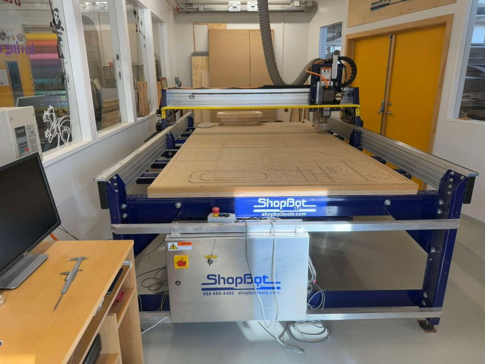

!!! info "Um Shopbot fræsinn"
  
     Við erum með ShopBot PRS-alpha tölvustýrðan fræsi með 1440 x 2190 x 150 mm vinnusvæði. Hægt er að lesa bækling um ShopBot fræsinn [hér](https://shopbottools.com/wp-content/uploads/2024/01/SBG-00142-User-Guide-20150317.pdf). Í bæklingnum er tekið fram að til að ná fram gæðaskurði er mikilvægt að velja réttan hraða fyrir hvern skurð (feed rate) og snúning á spindli/RPM. Talað er um **Move speed** þegar verið er að skera eða fræsa efni, eða **Feed rate**. Talað er um **Jog speed** þegar tækið hreyfist en er ekki að fræsa eða skera efni. Í bæklingnum er vísað í vefsíðuna [Onsrud.com](https://www.onsrud.com/) fyrir nánari upplýsingar um viðeigandi stillingar. 

## ShopBot - VCarve forritið

### Forrit sem notuð eru til að hanna og undirbúa 

!!! info " Fusion 360 og VCarve"
  
    Yfirleitt notum við forritin Fusion 360 og VCarve til að hanna og undirbúa skjöl. VCarve forritið er opnað með því að smella á táknið sem sést hér fyrir neðan.

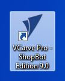

### VCarve

!!! info "Skjal hannað í Fusion 360 opnað í VCarve"
  
    Hægt er að flytja skjal út úr Fusion 360 sem .dxf og flytja það inn í VCarve.   

#### Að setja upp verkefni í VCarve

!!! info "Nýtt verkefni eða haldið áfram með verkefni frá því áður"
  
    Veljið hvort þið ætlið að halda áfram með verkefni eða búa til nýtt.

    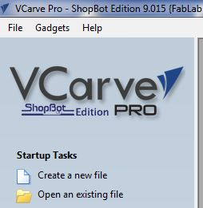

!!! info "Job size"
  
    Byrjað er á að setja upp verkefnið undir **Job setup**. 
    
    * Stærð vinnusvæðisins er stillt. Þetta svæði á að vera stærra en svæðið sem verður skorið/fræst. Þetta getur t.d. verið stærð efnisins sem notað verður, nema efnið sé mikið stærra. Þá getur hugsanlega verið hentugt að stilla vinnusvæðið 10mm stærra á lengd og breidd (eða meira). 

!!! info inline end "Job size"
  
    **Ein eða tvær hliðar**

    * Veldu hvort þú ætlar að fræsa eina hlið eða tvær á hönnuninni.
    
    **Stærð og þykkt efnis**

    * Athugið að mikilvægt er að mæla og skrá alltaf rétta þykkt efnis.

    * X og Y = lengd og breidd efnis

    * Z = þykkt efnis

    **Sjá nánar um Z zero og XY hér neðar**

    **Útlit (Appearance)**

    * Þú getur valið útlit efnisins undir Appearance. Hér er MDF valið.

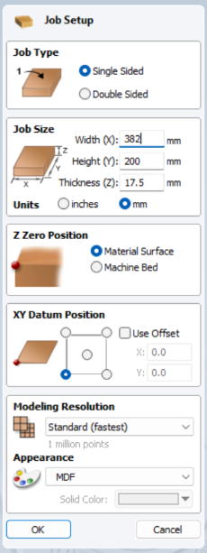

!!! warning "Z Zero position"

    Afar mikilvægt er að stilla Z zero position rétt. Annars er hætta á að árekstur verði eða að fræsibiti brotni. Skoðið því vel hvort upphafspunktur á að vera á yfirborði efnisins eða á yfirborði ShopBot fræsivélarinnar. Hér er Z zero position stillt á yfirborð efnisins.

    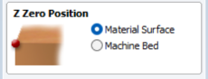

!!! warning "XY Datum position"

    Jafn mikilvægt er að vita hvar upphafspunktur X og Y er. **Upphafspunkturinn er alltaf neðst í vinstra horni.** 

     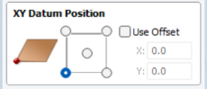

    Undantekning frá þessu getur verið ef unnið er með fræsingu út frá miðju í hring.

#### Samsetningar - dæmi

!!! info "Dogbones og T-bones"

    Í Vcarve er hægt að nota svokölluð **Dogbones eða T-bones** til að fræsa göt sem auðvelda samsetningu. Þá er smellt á táknið fyrir **Fillets** og bæta Dogbones eða T-bones við götin. Þegar búið er að velja hvaða gerð þú vilt nota þarf að smella á hvert einasta horn til að bæta þeim við.

### Að stilla ferilinn (Toolpath)

!!! info "Að velja toolpath"

    Ofarlega hægra megin á skjánum má sjá lítinn flipa sem er merktur með **Toolpaths**. Smelltu á hann til að opna stillingar.

    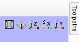

!!! info "Að halda toolpaths flipanum opnum"

    Smellt er á pínulitlu teiknibóluna til að halda Toolpath stillingarsvæðinu opnu.

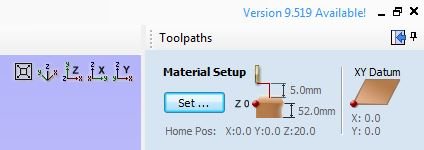

!!! info "Stillingar fyrir toolpath"

    * Hér er dæmi þar sem 2D Profile path var notað til að hanna fræstan prófíl. Upphafsdýptin var stillt á 0.0mm. Þykktin á efninu var um 12.1mm svo skurðardýptin var stillt á 12.3mm til að fara örugglega í gegnum efnið. 
    
    * Ferillinn var stilltur þannig að fræsitönnin myndi fræsa fyrir utan hönnunina. 

    * Sjá nánar um Tabs og Ramp neðar.

    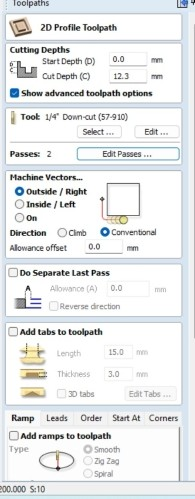

!!! info "Stillingar - Dýpt í hverri umferð"

    * Þegar smellt er á **Edit passes** er hægt að stilla hversu djúpt er farið í hverri umferð. 
    
    * **Það er ágætt viðmið að láta fræsitönnina ekki fara dýpra en helminginn af þvermáli sínu í hverri umferð:**

        * 1/4" fræsitönn fer þá ekki dýpra en 1/8". 

        * Ef þetta er reiknað í mm er tönnin rúmlega 6mm og fer þá ekki meira en 3mm á dýptina í hverri umferð.

    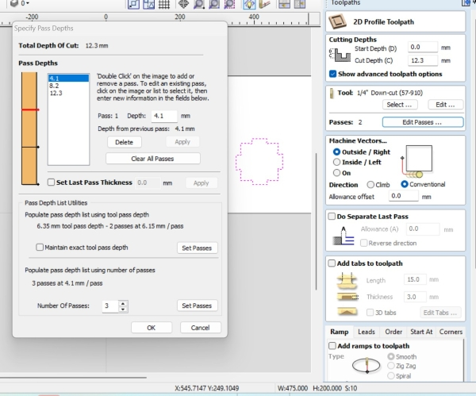

!!! info "Tabs"

    Athugið! Mikilvægt er að bæta við töppum með því að haka við **Add tabs to toolpath**. Þessir tappar tryggja að hlutir fari ekki á fleygiferð þegar þeir eru fræstir.

    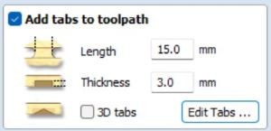

!!! info "Ramps"

    Hægt er að stilla.... **Ramps**

    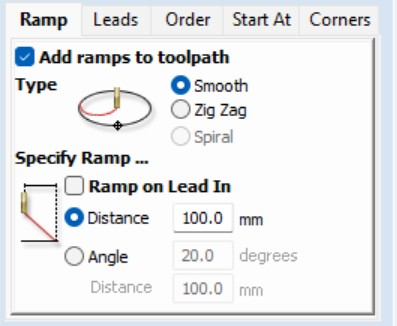

#### Að velja fræsitönn

!!! info "Að velja fræsitönn"

    Búið er að setja upp stillingar fyrir ýmsar fræsitennur.

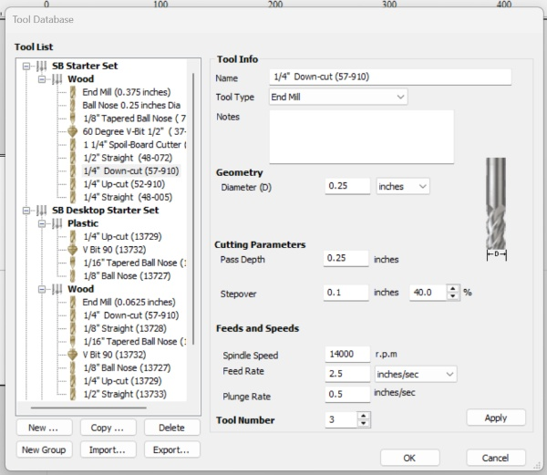

#### Að vista feril (Toolpath)

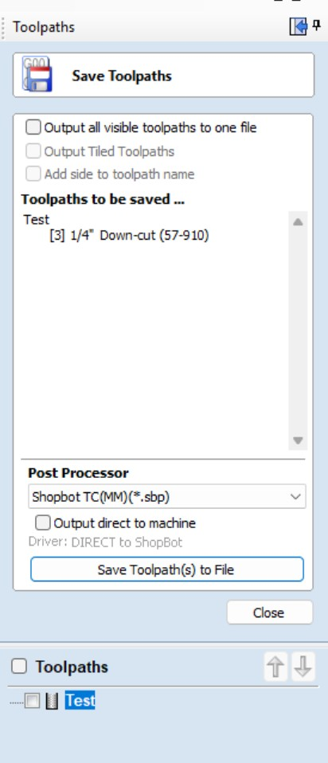

### Að nota ShopBot fræsinn

!!! info "Að kveikja á ShopBot fræsinum"
    
    Til að kveikja á ShopBot fræsinum er þessum takka snúið á **On**.

    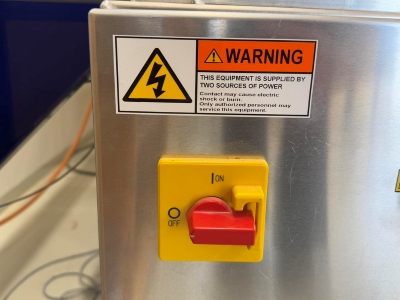

!!! info "Næst er ýtt á Reset hnappinn"
    
    Næsta skref er að ýta á bláa **Reset hnappinn**.

    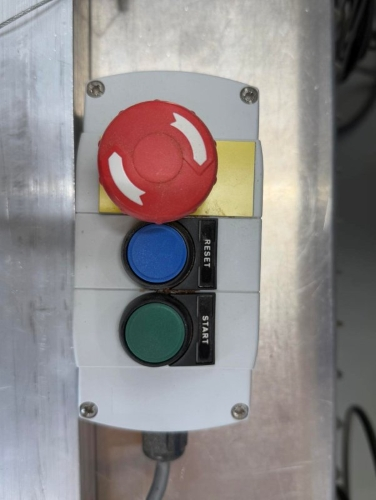

!!! info "Að opna ShopBot forritið"
    
    Smelltu á táknið fyrir ShopBot forritið.

#### Yfirlit ShopBot forrit/stjórntæki

!!! info "Yfirlit"
    
    Hér sjást þau forrit/stjórntæki sem notuð eru til að stýra ShopBot fræsinum. 

#### Að hita upp ShopBot fræsinn - Warmup routine

!!! warning "Mikilvægt er að hita upp ShopBot fræsinn"
    
    Áður en ShopBot fræsirinn er notaður er mikilvægt að hita hann upp.

!!! warning "Opnið fyrst Spindle control"

    Athugið! Fyrst þarf að opna **Spindle control** undir **Tools**. Þetta sýnir snúningshraða á spindilsins.

    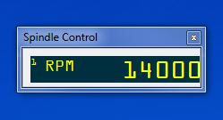

!!! info "Að opna stjórnborðið sem færir til fræsihausinn"

    Á þessum tímapunkti þarf að opna stjórnborðið sem notað er til að færa fræsihausinn til og frá. Smellt er á litla, gula táknið.
    
    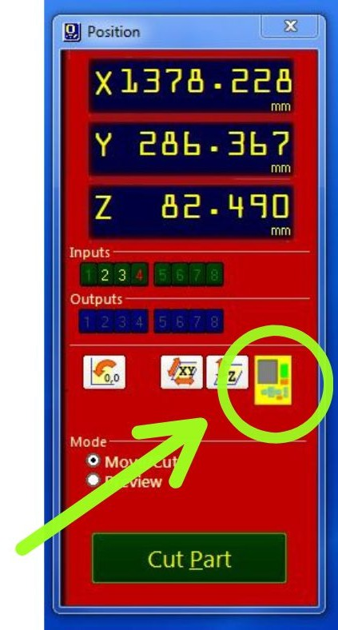

!!! info inline end "Að færa fræsihausinn"
  
    Örvahnapparnir eru notaðir til að færa fræsihausinn til. Það þarf að staðsetja hann á öruggum stað þar sem hann getur snúist, án þess að rekast í nokkuð, á meðan farið er í gegnum upphitunarferlið. Því er mikilvægt að hann sé hátt fyrir ofan yfirborðið.

    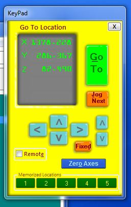  

!!! info "Upphitunarferlið (The warmup routine)"

    Smelltu á **Cut** og svo **Spindle warmup routine**. Á myndinni fyrir neðan sérðu gluggann sem opnast. Ýttu á græna **Start hnappinn**. 
    
    
    
    Smelltu svo á **OK** á skjánum. Þá fer fræsivélin í gegnum upphitunarferlið.

    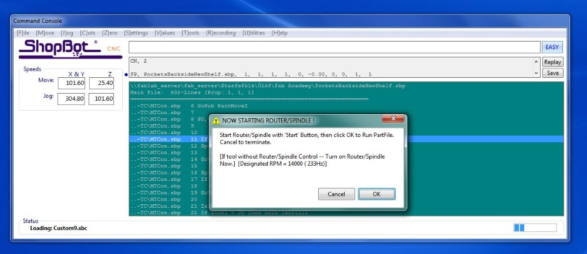

!!! info "Að skipta um fræsitönn"

    Eftir að upphitunarferlinu er lokið getur þú skipt um fræsitönn. Það má líka skipta um fræsitönn áður en farið er í gegnum upphitunarferlið.

    * Losaðu skrúfuna sem heldur plastkraganum föstum á fræsihausnum. Skrúfan er á bakhliðinni. 
    
    * Þá er hægt að ýta plastinu neðar til að hafa gott aðgengi að hausnum. 

    * Notaðu skiptilykil og tólið sem var fest við ShopBotinn með lykli.

    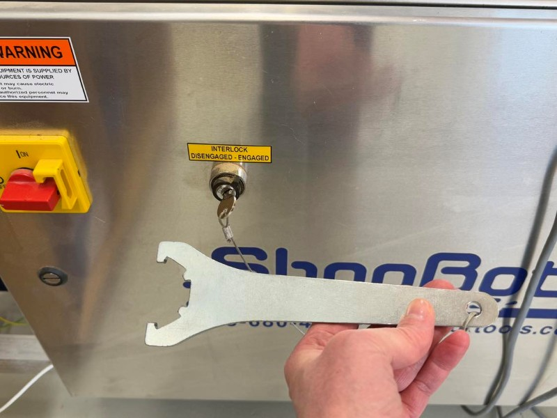
 
    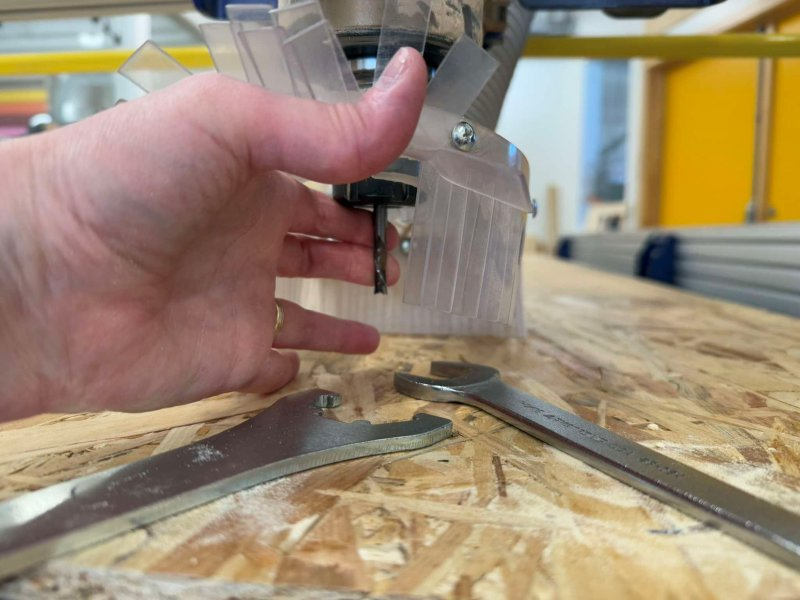

!!! info "Notaðu rétta kollettu"

    Stykkið sem fræsitönnin fer í kallast kolletta eða **Collet**. Þessi stykki eru til í mismunandi stærðum og því er mikilvægt að velja stærð sem passar utan um fræsitönnina sem á að nota.

    Áður en fræsitönnin er fest í þarf að banka collettunni aðeins í borðið og blása inn í hana til að tryggja að ekkert sag sé í henni. Annars er hætta á að hún herðist ekki nógu vel utan um fræsitönnina.

#### Zeroing the X- and Y-axis

!!! info "Zeroing the X- and Y-axis"

    Move the tool to the point over your material where you want the zero point to be. Make sure that it is the same X- and Y- point that you used in job setup in VCarve. Click on the small blue button on the Yellow keypad, marked as **Zero axis**. Then you put a checkmark in the boxes in front of the X- and Y- axis (NOT the z-axis!). Then you click on **Zero**.

    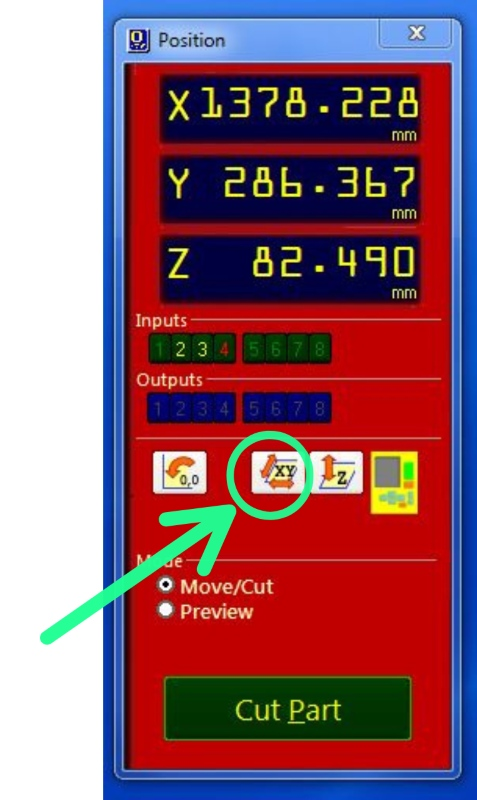

#### Zeroing the Z-axis

!!! info "Alligator clip"

    Here you can see the alligator clip that is used to zero the Z-axis. 

    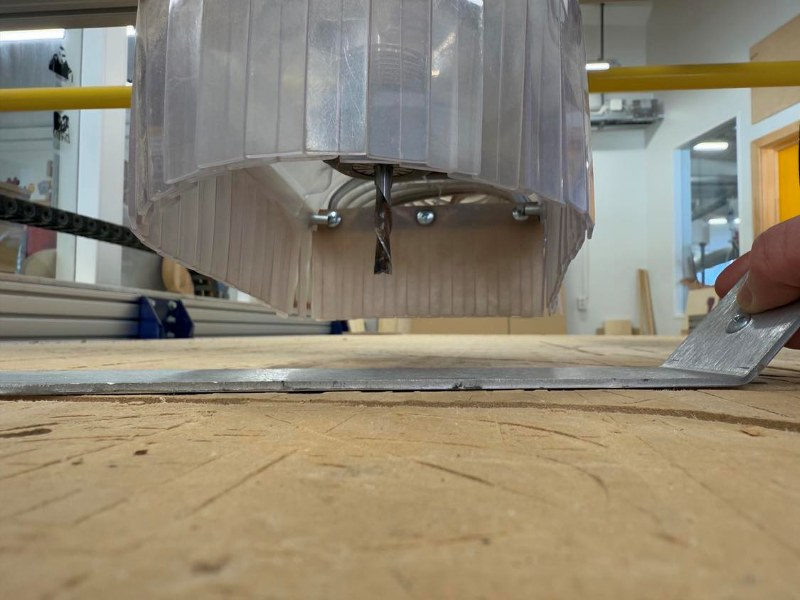

!!! info

    You begin by letting the alligator clip touch the endmill and check if a green light appears in input nr. 1.

!!! info "Zeroing the Z-axis"

    You begin by clicking on the small symbol that shows Z and arrows.

   

!!! info "Place alligator clip under endmill"

    The program will ask you if the alligator clip is placed under the bit. Make sure it is! Then you follow the directions on the screen and hit the right button. The tool will move down and when the endmill touches the alligator clip, it will go up again. Note! The tool will repeat this process so keep the alligator clip until the endmill has lowered and touched the clip TWO TIMES!

!!! warning "Is Zero for Z-axis supposed to be on top of material on or machine bed?"
    
    Before you begin with zeroing the Z-axis, think carefully about whether you are supposed to zero the Z-axis on top of the material or on the machine bed. Make sure that you are choosing the same as you used as in the job setup in VCarve.

#### Performing the cut

!!! info "Ready to perform the job"

    Now the machine is ready to start machining or cutting. Close the yellow keypad. Then you click on the **Cut Part** button, find the job you want to do and double-click on it. Then you click on the **Green Start button**.

!!! info "Turn on the dust collector"

    After pushing the start button you give the tool a little time to spin while you turn the dust collector on. My co-teacher told me once that [Bas Withagen](https://fabacademy.org/2012/students/bas.withagen/index.html) this was a good time to prey to the ShopBot God that everything will work out fine.

!!! info "Click on start"

    Finally, you click on the **Start** on the screen.

    