# Áfangar hjá Verkmenntaskóla Austurlands

## Að nota Inkscape forritið

!!!Info "Inkscape forritið"

    Við ætlum að nota forrit sem heitir Inkscape. Með því getum við hannað ótrúlega margt, til dæmis límmiða sem hægt er að skera út úr vínyl í vínylskera. Við getum líka hannað eitthvað til að skera og rastera í laser.

!!!Info "Að opna Inkscape"

    Ef þið sjáið ekki táknið getið þið skrifað Inkscape í leitargluggann neðst á skjánum.

    

!!!Info "Tvísmellið á táknið"

    Tvísmellið svo á táknið þegar þið sjáið það. Stundum er forritið lengi að opnast svo það er gott að bíða smástund til að sjá hvort það opnist. Annars tvísmellið þið aftur.

    

### Að skipta um tungumál í Inkscape

!!! Tip "Íslenska eða annað tungumál"

    Það er hægt að skipta um tungumál í Inkscape en **það þarf að loka forritinu þegar búið er að skipta um tungumál og opna forritið svo aftur**. Smellið á Breyta og svo Kjörstillingar. Hér fyrir neðan sjáið þið hvernig þetta lítur út þegar forritið er stillt á íslensku og þegar það er stillt á ensku.

               

!!!Tip "Íslenska eða annað tungumál - framhald"

    Því næst smellið þið á Viðmót (á ensku er það Interface) og þá sjáið þið hvar þið getið valið tungumál. Munið svo að loka forritinu og opna það aftur.

                

### Að vista verkefnin á réttum stað

### Að búa til möppu

!!!Example "Búðu til möppu fyrir þig ef þú átt ekki möppu"

    - Smelltu á **gula möpputáknið** neðst á skjánum. 

    - Smelltu svo á  **Desktop**. 

    - Næst smellir þú á **Fab Server** táknið sem er eins og gula mappan nema með grænum lit líka.  

    - Smelltu á **FABL1GR02**.
    
    - Hægrismelltu á skjáinn og veldu **Nýtt (New)** og svo **Mappa (Folder)**
    
    - Merktu möppuna með þínu nafni.

    - Ath! Best er að vista oft á meðan þú vinnur verkefnið, svo upplýsingar glatist ekki.

### Að velja rétta möppu þegar vistað er í Inkscape

!!!Example "Vistaðu Inkscape verkefnin þín í réttri möppu"

    Þegar þú vistar verkefnin skaltu passa að þau séu að vistast í þinni möppu en ekki möppu sem einhver annar á. Þú gerir þetta svona:

    - Farðu í **Skrá (File)** og veldu **Vista sem (Save As)**. 
    
    - Veldu möppuna sem þú vilt vista verkefnið í. 

    - Smelltu á **Vista (Save)**.

    - Ath! Best er að vista oft á meðan þú vinnur verkefnið, svo upplýsingar glatist ekki.

## FABL1GR05

### 1 - Að búa til límmiða í BN-20 litaprentaranum

!!!Success "Að finna mynd á netinu"

    * Leitaðu að einhverju spennandi á netinu. 
    * Smelltu á **Mynd (Image)**. 
    * Smelltu svo á **Verkfæri (Tools)** 
    * Veldu Creative Commons leyfið.

    

    * Vistaðu myndina í möppunni þinni.

!!!Success "Að flytja myndina inn í Inkscape"

    * Opnaðu Inkscape forritið
    * Veldu **Skrá (File)** og **Flytja inn (Import)**. 
    * Veldu myndina og smelltu á **Opna (Open)**.
    * Smelltu á **Í lagi (OK)**.

!!!Success "Að stilla stærðina á myndinni"

    * Veldu myndina með því að smella á hana.
    * Hafðu lásinn fyrir ofan myndina lokaðan.
    * Stilltu stærðina á myndinni. Hér er hæðin til dæmis stillt á 50mm.

    

!!!Success "Að láta vinnusvæðið (blaðsíðuna) passa utan um myndina - skref 1"

    Þegar hönnunin er tilbúin er blaðsíðan oft stærri en það sem þið ætlið að búa til. Þá er gott að minnka blaðsíðuna til að efnið nýtist betur. Það gerið þið svona:

    * Hægrismellið á skjáinn og veljið **Eiginleikar skjals (Document properties)**. 
    * Ef það virkar ekki er hægt að smella á **Skrá (File) og Skráareiginleikar (Document Properties)**. 

    

   
!!!Success "Að láta vinnusvæðið (hvítu blaðsíðuna) passa undir myndina - skref 2"

    * Smellið svo á litla hnappinn hægra megin við **Aðlaga stærð að innihaldi (Resize to content).** Þá minnkar hvíta svæðið þannig að það passar nákvæmlega utan um hönnunina. 

    

!!!Success "Vinnusvæðið aðlagað og tilbúið"

    * Nú sjáið þið að vinnusvæðið(hvíta blaðsíðan) er bara undir myndinni.

    

!!!Success "Að vista verkefnið"

    Veldu **File** og svo **Save As**. Vistaðu svo verkefnið sem **.pdf** skjal.

### 2 - Límmiði búinn til í vínylskera

!!!question "Mikilvæg upprifjun"

    Það er líklegt að þú hafir búið til límmiða áður en þetta er mikilvæg upprifjun og því vinna allir þetta verkefni. Hafðu í huga að það er hægt að búa til allt mögulegt. Þú getur til dæmis búið til límmiða á tölvuna þína, límmiða á veggi, fatalímmiða og endurskinsmerki.

    Þú getur skoðað hugmyndir á Pinterest [hér](https://www.pinterest.com/hannesdttir/l%C3%ADmmi%C3%B0ar/).

!!!question "Hvaða aðferð finnst þér best?"

    Hvort finnst þér betra að lesa leiðbeiningar eða horfa á kennslumyndband? Veldu annaðhvort **Skriflegar leiðbeiningar** eða **Kennslumyndband** hér fyrir neðan.

#### Skriflegar leiðbeiningar - Límmiði

!!!Tip "Skriflegar leiðbeiningar um gerð límmiða"

    Farið eftir leiðbeiningunum [hér](https://www.fabmennt.com/_files/ugd/0ebced_5a3d811e82fa4290be7d3fb604a5251b.pdf). Lesið samt fyrst upplýsingarnar hér fyrir neðan. *Leiðbeiningarnar gerði Hafey Viktoría Hallgrímsdóttir hjá Fab Lab Reykjavík.*

!!!Tip "Tvö mikilvæg atriði"

    Munið að vista verkefnið reglulega með því að ýta á **Skrá og Vista**  eða **File og Save**. Þið getið líka vistað með því að **halda inni CTRL takkanum og ýta á bókstafinn S**.

    **Athugið að vista verkefnið í lokin bæði sem Inskcape skjal (með endingunni .svg) og PDF skjal (með endingunni .pdf).** 

!!!Tip "Eitt mikilvæg atriði til viðbótar"

    Þegar hönnunin er tilbúin er blaðsíðan oft stærri en það sem þið ætlið að búa til. Þá er gott að minnka blaðsíðuna til að efnið nýtist betur. Það gerið þið svona:

    Smellið á **Skrá (File) og Skráareiginleikar (Document Properties)**. Það er líka hægt að hægrismella á skjáinn og velja **Eiginleikar skjals (Document properties)**. Smellið svo á litla hnappinn hægra megin við **Aðlaga stærð að innihaldi (Resize to content).** Þá minnkar hvíta svæðið þannig að það passar nákvæmlega utan um hönnunina. Svo þarf að stækka það aðeins með því að smella þrisvar sinnum á báða plúsana.

           

!!!Tip "Mismundandi útlit í tölvum"

    Stundum lítur þetta öðruvísi út í tölvum (sjá hér fyrir neðan). Þá þarf að skrifa 1 í alla fjóra gluggana og smella svo á ,,Laga síðu að teikningu eða vali“ (Resize page to content).

    

#### Kennslumyndband - límmiði

!!!Tip "Myndband"

    Myndbandið hér [hér](https://www.fabmennt.com/myndbondvinyl?wix-vod-video-id=db87a908a65e4c71819b4b41228c9e97&wix-vod-comp-id=comp-l028k5p5) sýnir hvernig límmiði er búinn til. *Leiðbeiningarnar gerði Andri Sæmundsson hjá Fab Lab Reykjavík*

    

    Munið að vista verkefnið reglulega með því að ýta á **Skrá og Vista**  eða **File og Save**. Þið getið líka vistað með því að **halda inni CTRL takkanum og ýta á bókstafinn S**.

    **Athugið að vista verkefnið í lokin bæði sem Inskcape skjal (með endingunni .svg) og PDF skjal (með endingunni .pdf).** 

### 3 - Fatalímmiði

!!! Example "Leiðbeiningar"
    
    Fatalímmiðar eru búnir til með sömu aðferðum og límmiðar nema það þarf að spegla texta og myndum áður en skorið er út í vínylskeranum. Þið getið skoðað hugmyndir [hér](https://www.pinterest.com/hannesdttir/l%C3%ADmmi%C3%B0ar/). 

    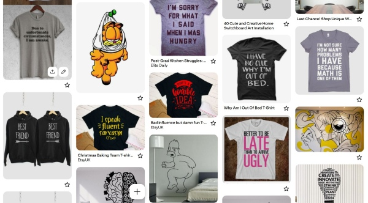

    Svo er einnig hægt að búa til endurskinsmerki. Hér fyrir neðan má sjá dæmi um það.
    
    

!!! Example "Leiðbeiningar um gerð fatalímmiða"
    
    Smelltu [hér](https://1b1b4ded-19ea-40be-a62c-dedafc37e7fe.filesusr.com/ugd/0ebced_54564a0e5c5747d6830468d2538f045b.pdf) til að skoða leiðbeiningar um hvernig hægt er að búa til fatalímmiða. *Höfundar: Hafey Viktoría Hallgrímsdóttir.*

!!! Example "Myndbönd um gerð fatalímmiða"
    
    Smelltu [hér](https://www.fabmennt.com/myndbondvinyl?wix-vod-video-id=b724cff07d044bd5a87b5d8a051c8047&wix-vod-comp-id=comp-l0290nvu) til að skoða kennslumyndband um hvernig hægt er að búa til fatalímmiða. *Höfundar: Andri Sæmundsson.*

#### Að búa til mynstur (límmiðar/fatalímmiðar og fleira)

!!!Info "Að finna mynd á netinu"

    * Bættu orðinu **Silhouette** eða **Black and white** fyrir aftan leitarorðið þitt til að fá skýra, svart/hvíta mynd. 
    * Smelltu á **Mynd (Image)**. 
    * Smelltu svo á **Verkfæri (Tools)** 
    * Veldu Creative Commons leyfið.

    

    * Vistaðu myndina.

!!!Info "Að flytja myndina inn í Inkscape"

    * Opnaðu Inkscape forritið
    * Veldu **Skrá (File)** og **Flytja inn (Import)**. 
    * Veldu myndina og smelltu á **Opna (Open)**.
    * Smelltu á **Í lagi (OK)**.

!!!Info "Að búa til vektormynd"

    * Veldu **Ferill (Path)** og **Línuteikna bitamynd (Trace bitmap)**. 
    * Þegar smellt er á **Uppfæra (Update)** er sýnt hvernig myndin muni líta út. Reyndar gefur það ekki alltaf nákvæma mynd en oftast virkar það sem **Preview**. 
    * Smellið svo á **Í lagi (Apply)**. Í sumum tölvum stendur **Virkja** en ekki **Í lagi**. 
    * Vinstri-smelltu með músinni ofan á myndina, haltu takkanum inni og dragðu myndina til hliðar. 
    * Smellið til skiptis á báðar myndirnar. Þegar það stendur ,,Mynd“ (Image)  neðst á skjánum má eyða þeirri mynd. 

!!!Info "Að búa til mynstur í Inkscape"

    * Veldu myndina.
    * Smelltu á **Breyta (Edit)**, svo **Klóna (Clone)** og að lokum á **Búa til tíglaða klóna (Create tiled clones)**.

    

    * Á myndinn hér fyrir neðan sést hvernig búið er að nota litlu örina hægra megin til að velja **CM: speglun + spegilhliðrun**. Það sést einnig neðarlega að búið er að skrifa 4 raðir og 4 dálka. Útkoman sést á myndinni.  

    

    * Taktu eftir því að það eru örvar í kringum upphaflegu vektormyndina. Hún liggur í raun ofan á mynstrinu sem þú varst að búa til. Dragðu hana til hliðar. Þú getur notað þessa vektormynd til að prófa þig áfram með önnur mynstur. Prófaðu að nota örina og velja aðrar útfærslur

    

    * Veldu mynstrið sem þú vilt eiga. **Hægrismelltu á skjáinn** og veldu **Eiginleikar skjals (Document properties)**. 
    * Smelltu á **Aðlaga stærð að innihaldi (Resize to content)**.
    * Smelltu þrisvar á báða plúsana.
    * Færðu mynstrið inn á miðja blaðsíðuna.
    * Vistaðu skjalið sem **.svg og sem .pdf.**

#### Að búa til límmiða í mörgum litum

!!!Example "Að finna mynd á netinu sem hægt er að hafa í nokkrum litum"

    * Bættu orðinu **Silhouette** eða **Black and white** fyrir aftan leitarorðið þitt til að fá skýra, svart/hvíta mynd. Leitaðu eftir mynd sem hægt er að gera í a.m.k. þremur litum.
    * Smelltu á **Mynd (Image)**. 
    * Smelltu svo á **Verkfæri (Tools)** 
    * Veldu **Creative Commons leyfið**.

    

    * Vistaðu myndina.

    * Ath! Þú getur líka leitað að mynd í lit en hún verður þá að vera mjög skýr með miklum andstæðum (contrast) á milli litaðra svæða. Þessi mynd hér fyrir neðan var tekin af slóðinni [hér](https://vectorportal.com/vector/skull-sticker/35973)

    Við viljum virða höfundarrétt og á þessari síðu er óskað eftir því að vísað sé í höfundinn og leyfið sem veitt er á þennan hátt:

    Image by <a href=" https://www.vectorportal.com" >Vectorportal.com</a>,  <a class="external text" href="https://creativecommons.org/licenses/by/4.0/" >CC BY</a>

    

!!!Example "Að flytja myndina inn í Inkscape"

    * Opnaðu Inkscape forritið
    * Veldu **Skrá (File)** og **Flytja inn (Import)**. 
    * Veldu myndina og smelltu á **Opna (Open)**.
    * Smelltu á **Í lagi (OK)**.

!!!Example "Að búa til vektormynd"

    * Veldu **Ferill (Path)** og **Línuteikna bitamynd (Trace bitmap)**. 
    * Þegar smellt er á **Uppfæra (Update)** er sýnt hvernig myndin muni líta út. Reyndar gefur það ekki alltaf nákvæma mynd en oftast virkar það sem **Preview**. 
    * Smellið svo á **Í lagi (Apply)**. Í sumum tölvum stendur **Virkja** en ekki **Í lagi**. 
    * Vinstri-smelltu með músinni ofan á myndina, haltu takkanum inni og dragðu myndina til hliðar. 
    * Smellið til skiptis á báðar myndirnar. Þegar það stendur ,,Mynd“ (Image)  neðst á skjánum má eyða þeirri mynd. 

    

!!!Example "Að sundra öllu"

    * Veldu myndina. 
    * Smelltu á **Ferill (Path)** og veldu **Sundra (Break apart)**. Þá verður myndin oft alveg svört en þá er til dæmis hægt að slökkva á fyllingunni og kveikja á línunni, sjá hér á eftir.
    * Smelltu á **Hlutur (Object)** og veldu **Fylling og útlína (Fill and stroke)**.
    * Smelltu á **Litur útlínu (Stroke paint)** og veldu **Flatur litur (Flat color – sem er skammstafað RGB)** og stilltu **rauðan í fullt (255)**. 
    * Smelltu á **Stíll útlínu (Stroke style)** og stilltu línurnar á **0.100mm**. Þá sjást allar línur vel á meðan unnið er með myndina. **Passaðu svo að muna eftir því að stilla línurnar seinna þannig að þær verði skurðarlínur. Það verður útskýrt betur seinna í verklýsingunni**.

    

!!!Example "Að búa til ferhyrning til viðmiðunar fyrir samsetningu"

    * Smelltu á kassatáknið og teiknaðu lítinn ferhyrning við hliðina á myndinni. (Sjá myndina hér fyrir ofan og svo nærmyndina af ferhyrningunum hér fyrir neðan).
    * Teiknaðu svo annan minni ferhyrning innan í. Stærri ferhyrningurinn verður að útlínum fyrir minni ferhyrninginn. Það koma betri útskýringar um notkun kassanna á eftir.

    

!!!Example "Að búa til sér skjal fyrir hvern lit"

    * Þessi límmiði á að vera í þremur litum og þess vegna þarf að búa til þrjú Inkscape skjöl. 
    * Hér fyrir neðan sést hvaða línur skera hvern lit. Undir línunum eru myndir af límmiðunum sem verða skornir út. Vinstra megin eru línurnar sem eiga að skera gulan, í miðjunni er línan sem á að skera svartan og til hægri eru línurnar sem eiga að skera hvítan. Gula hlutann þarf að skera tvisvar vegna þess að litlu bútarnir eiga að vera efst. **Mikilvægt!: Þessi mynd er einungis sett svona upp til að útskýra. Það má alls ekki færa línurnar í sundur, heldur þarf að vista eitt skjal fyrir hvern lit. Svo má eyða línum en alls ekki færa línurnar!**

    

    * Vistaðu eitt skjal fyrir hvern lit:
    * Farðu fyrst í **Skrá (File)** og veldu **Vista sem (Save as)** til að vista fyrsta skjalið í Inkscape. Gefðu skjalinu nafn, til dæmis **Hauskúpa_svört**.
    * Smelltu svo á **Skrá (File)** og veldu **Vista sem (Save as)** til að vista annað skjalið í Inkscape. Gefðu skjalinu nafn, til dæmis **Hauskúpa_hvít**.
    * Farðu svo aftur í **Skrá (File)** og veldu **Vista sem (Save as)** til að vista þriðja skjalið í Inkscape. Gefðu skjalinu nafn, til dæmis **Hauskúpa_gul**.
 
!!!Example "Skjal fyrir stærsta límmiðann/grunninn"

    * Skoðaðu myndina vel og veldu hvaða svæði hentar sem stærsti límmiðinn sem hinir límmiðarnir (hinir litirnir) verða límdir ofaná. Hér var ákveðið að það væri hentugt að velja ystu línuna og nota gulan sem grunn. 
    * Skjalið sem heitir **Hauskúpa_Gul** var opnað.
    * Þar var öllum línum úr hauskúpunni eytt nema ystu línunni. Hinir litirnir voru svo límdir ofan á þetta form þegar búið var að skera út límmiðana.
    * ATH! Þegar farið var að plokka burtu það sem á ekki að vera hjá þessum límmiða var passað að plokka litla ferhyrninginn innan úr stóra ferhyrningnum. **Semsagt: Í skjalinu fyrir stærsta límmiðann á að plokka litla ferhyrninginn innan úr stóra ferhyrningnum. Hér er það þá ljósblái ferhyrningurinn sem á að plokka burt af límmiðanum.**

    
    
    * Svo var smellt á **Skrá (File)** og **Skráareiginleikar (Document Properties)**. Svo var smellt á **Aðlaga stærð að innihaldi (Resize to content)** til að nýta efnið vel.
    * Svo voru skurðarlínur eins og lýst er hér neðar.

!!!Example "Að stilla skurðarlínur"

    Smelltu svo á **Hlutur (Object)** og veldu **Fylling og útlína (Fill and stroke)**. Veldu fyrst flipann sem er merktur **Fylling (Fill)**. Þar á að slökkva á fyllingunni með því að velja **X**.

    

    Veldu næst flipann sem er merktur **Litur útlínu (Stroke paint)** og kveiktu með því að **velja reitinn við hliðina á x-inu**. Stilltu svo rauða litinn á **255**.

    

    Veldu flipann sem er merktur **Stíll útlínu (Stroke style)** og stilltu breidd línunnar (width) á 0.02 mm.

    

!!!Example "Að stilla síðuna og vista skjalið"

    * **Hægrismelltu á skjáinn** og veldu **Eiginleikar skjals (Document properties)**. 
    * Veldu myndina.
    * Smelltu á **Aðlaga stærð að innihaldi (Resize to content)**.
    * Smelltu þrisvar á báða plúsana.
    * Færðu myndina inn á miðja blaðsíðuna.
    * Vistaðu skjalið sem **.svg og sem .pdf.**

!!!Example "Skjölin fyrir hina litina"

    * Opnaðu hin skjölin með skurðarlínunum fyrir hina litina. 
    * Eyddu öllum línum sem eiga ekki að vera.
    * Aðlagaðu stærð skjalsins að innihaldi, eins og gert var í fyrsta skjalinu.
    * Stilltu skurðarlínur, eins og gert var í fyrsta skjalinu.
    * Vistaðu skjalið sem **.svg** og sem **.pdf**, eins og í fyrsta skjalinu.
    * Þegar búið er að skera út límmiðana í þessum litum er stærri ferhyrningurinn plokkaður í burtu (dökkblái ferhyrningurinn sem sést hér fyrir neðan):

    

!!!Example "Límmiðabútum raðað saman"

    * Þegar búið er að skera út límmiðana í öllum litum er flutningsfilma notuð til að flytja límmiðabútana ofan á stóra límmiðann. 
    * Látið litla ferhyrninginn passa innan í stóra ferhyrninginn. Þannig lendir allt á réttum stað.

    

## 4 - Tinkercad

!!! Info "Tinkercad verkefni"

    Veljið eitt af verkefnunum hér fyrir neðan:

### Kennslumyndband - bíll

!!! Info "Kennslumyndband sem kennir hvernig hægt er að búa til bíl"

    Smellið á hlekkinn [hér](https://www.youtube.com/watch?v=2kxz7didxbc&list=PL_lCWSMS2Py_HUTgWf9RVKJb8p6fBjW32). 

    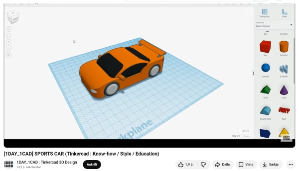

### Kennslumyndband - Star Wars Tie Fighter

!!! Info "Kennslumyndband sem kennir hvernig hægt er að búa til Star Wars Tie Fighter"

    Smellið á hlekkinn [hér](https://www.youtube.com/watch?v=t2kNYBLz3gw). 

    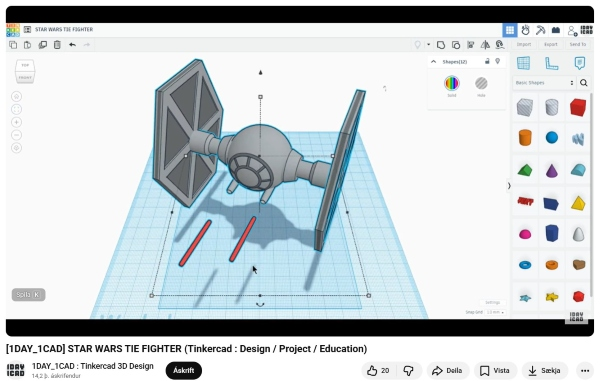

### Kennslumyndband - Bráðnaðir frostpinnar

!!! Info "Kennslumyndband sem kennir hvernig hægt er að búa til bráðnaða frostpinna"

    Smellið á hlekkinn [hér](https://www.youtube.com/watch?v=RrwELCh52us). 

    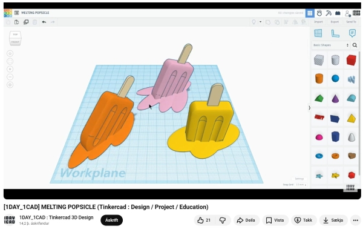

### Kennslumyndband - Völundarhús/byrjun

!!! Info "Kennslumyndband sem kennir hvernig hægt er að búa til völundarhús"

    Athugið að þið getið notað **CTRL+D** til að tvöfalda veggi innan í völundarhúsinu og breytt svo löguninni. Þið getið annað hvort gert holu í botninn þar sem kúlan á að enda eða gert gat í útvegginn.
    
    Smellið á hlekkinn [hér](https://www.youtube.com/watch?v=BJXbw9-k8Fw). 

    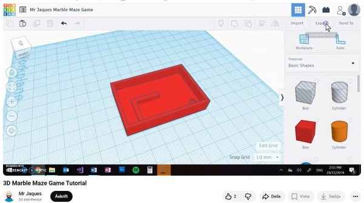

### Kennslumyndband - Völundarhús/flóknara

!!! Info "Kennslumyndband sem kennir hvernig hægt er að búa til flóknara völundarhús"

    Smellið á hlekkinn [hér](https://www.youtube.com/watch?v=TSNoGg1K4LY). 

    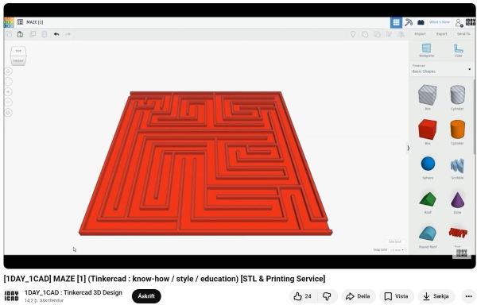

### Kennslumyndband - Hjartabox

!!! Info "Kennslumyndband sem kennir hvernig hægt er að búa til hjartalaga box"

    Smellið á hlekkinn [hér](https://www.youtube.com/watch?v=9h7oXrpuxrg). 

    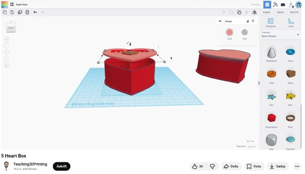

## 5 - Smáhlutur búinn til í laser (geislaskera) 

!!! Example "Smáhlutur skorinn og rasteraður"
    
    Búðu til smáhlut í laser. Það getur verið lyklakippa, glasamotta, eyrnalokkar eða annað svipað.

    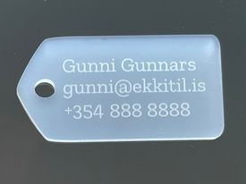  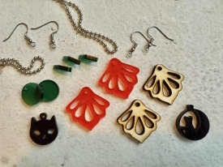

### Skriflegar leiðbeiningar

!!! Example "Leiðbeiningar um gerð glasamottu, Halloween skreytinga, lyklakippu, jólaskrauts og fleira"
    
    Smelltu [hér](https://www.fabmennt.com/leidbeiningargeisla) til að skoða leiðbeiningar um hvernig hægt er að búa til glasamottu, Halloween skreytinga, lyklakippu, jólaskrauts og fleira. *Höfundar: Hafey Viktoría Hallgrímsdóttir.*

## 6 - Hlutur með rennismellum búinn til í laser (geislaskera) 

!!! Example "Að búa til rennismellur"
    
    Búðu til hlut í laser sem festur er saman með rennismellum. Það getur verið allt mögulegt, líkt og sjá má á myndunum hér fyrir neðan. Dæmin hér fyrir neðan og fleiri má finna [hér](https://www.pinterest.com/pin/562527809712262231/) og [hér](https://www.pinterest.com/hannesdttir/laser/)

    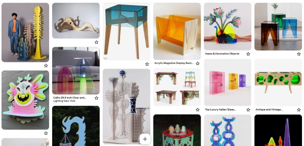

    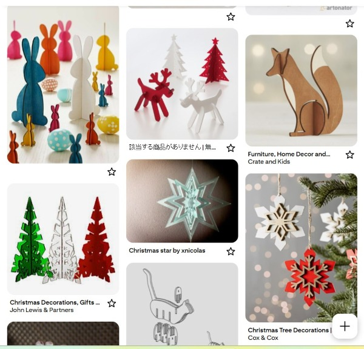

### Skriflegar leiðbeiningar

!!! Example "Leiðbeiningar um hvernig hægt er að búa til hlut með rennismellum"
    
    Smelltu [hér](https://1b1b4ded-19ea-40be-a62c-dedafc37e7fe.filesusr.com/ugd/0ebced_d9c3f8b01f3343d1b9cdb20555951928.pdf) til að skoða leiðbeiningar um hvernig hægt er að búa til hlut með rennismellum. *Höfundar: Hafey Viktoría Hallgrímsdóttir.*

### Kennslumyndbönd

!!! Example "Myndbönd um hvernig hægt er að búa til hlut með rennismellum"
    
    Smelltu [hér](https://www.fabmennt.com/myndbondgeisla?wix-vod-video-id=2cc7ba8af64649318bb3ec98d6022eaf&wix-vod-comp-id=comp-l0gj7s07) til að skoða kennslumyndbönd um hvernig hægt er að búa til hlut með rennismellum. *Höfundur: Andri Sæmundsson.* 
    
## 7 - Box búið til í laser (með hjálp vefsíðu) 

!!! Example "Að búa til box í laser með hjálp vefsíðu"
    
    Búðu til box á vefsíðunni [Makercase.com](https://www.makercase.com/). 

    **Þú getur búið til Basic box og Curved box en ef þú ætlar að velja einhver af hinum boxunum þarftu að búa til aðgang.**

    **Ath að þú þarft að stilla Kerf á 0,1 en ekki 0,18 eins og í leiðbeiningunum. Þetta er sjálfgefin stilling á vefsíðunni og því þurfið þið ekki að breyta henni.**

    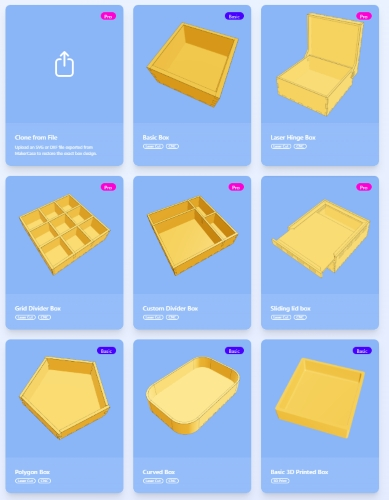

    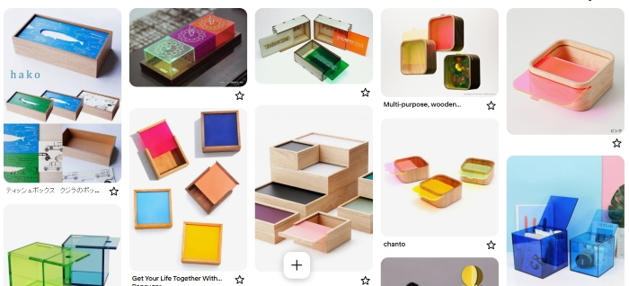

### Skriflegar leiðbeiningar

!!! Example "Leiðbeiningar um hvernig hægt er að búa til box með hjálp vefsíðu"
    
    Smelltu [hér](https://1b1b4ded-19ea-40be-a62c-dedafc37e7fe.filesusr.com/ugd/0ebced_6eb143456cd24ca0a3df49bc6802ef71.pdf) til að skoða leiðbeiningar um hvernig hægt er að búa til box með hjálp vefsíðu. *Höfundar: Hafey Viktoría Hallgrímsdóttir.*

### Kennslumyndbönd

!!! Example "Myndbönd um hvernig hægt er að búa til box með hjálp vefsíðu"
    
    Smelltu [hér](https://www.fabmennt.com/myndbondgeisla?wix-vod-video-id=9088ac526209462a850c5b30381395f4&wix-vod-comp-id=comp-l0gj7s18) til að skoða kennslumyndbönd um hvernig hægt er að búa til box með hjálp vefsíðu. *Höfundur: Andri Sæmundsson.*

    
## 8 - Texti eða mynd saumuð út í textíl

!!! Example "Að nota útsaumsvél til að sauma út mynd eða texta í textíl"
    
    Þú getur valið hvaða aðferð þú vilt nota. Þú getur farið beint í útsaumsvélina og valið texta eða mynd þar. Þú getur líka fundið mynd á netinu og notað annað hvort aðferð A eða B þegar þú undirbýrð myndina fyrir útsaumsvélina. Með aðferð A finnur þú mynd á netinu sem er útlínuteikning (notar leitarorðin coloring pages eða outline). Með aðferð B finnur þú litmynd á netinu sem er mjög einföld og skýr mörk á milli litaðra svæða. Myndin má ekki vera í mörgum litum.

### Að útbúa mynd fyrir saumavélina

!!! info "Aðferð A - Að útbúa mynd fyrir saumavélina"
    
     Byrjaðu á að opna Inkscape. Fylgdu svo leiðbeiningunum [hér](https://www.flr.is/_files/ugd/0ebced_1bd42ec7d77140aea1e74aec7377078f.pdf) í bók eftir Hafey Hallgrímsdóttur um hvernig eigi að búa til límmiða (fyrsta verkefnið í bókinni). Fylgdu öllum leiðbeiningum þar til þú hefur búið til vektor teikningu. Athugaðu að bæta **outline** eða **coloring pages** við leitarorðin þegar þú leitar á netinu - **Ekki Silhouette eins og þegar þú gerir venjulega límmiða.**

     Hér var pennateikningu notuð en það er líka hægt að nota myndir af netinu.
     
     Næst smellir þú á **Hlutur** og svo **Fylling og útlína**, kveiktu á **Fyllingu** og slökktu á **Lit útlínu**.
     

!!! info "Aðferð B - Að útbúa mynd fyrir saumavélina"
    
     Finndu einfalda litmynd á netinu með skýrum mörkum á milli litaðra svæða. Myndin má ekki vera í mörgum litum.

     Veldu **Ferill (Path)** og **Línuteikna bitamynd (Trace bitmap)**. 
     
     Veldu svo **Multicolor** og undir því **Colors**.
     
     Næst smellir þú á **Virkja (Apply)**.
     
    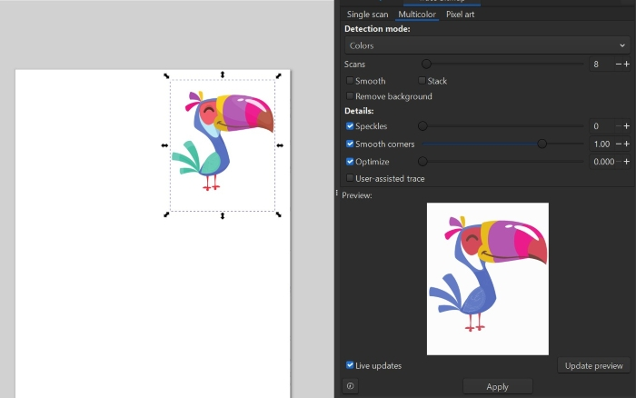

!!! info "Að eyða upphaflegu myndinni"
    
     Eyddu upphaflegu myndinni.

    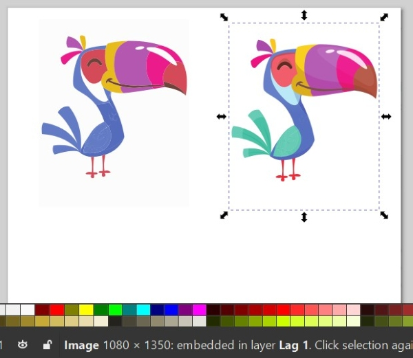

!!! info "Að skipta upp svæðum"
    
     Veldu **Extensions**, svo **Inkstitch**, því næst **Tools: Fill** og að lokum **Break apart filled objects**.
     
    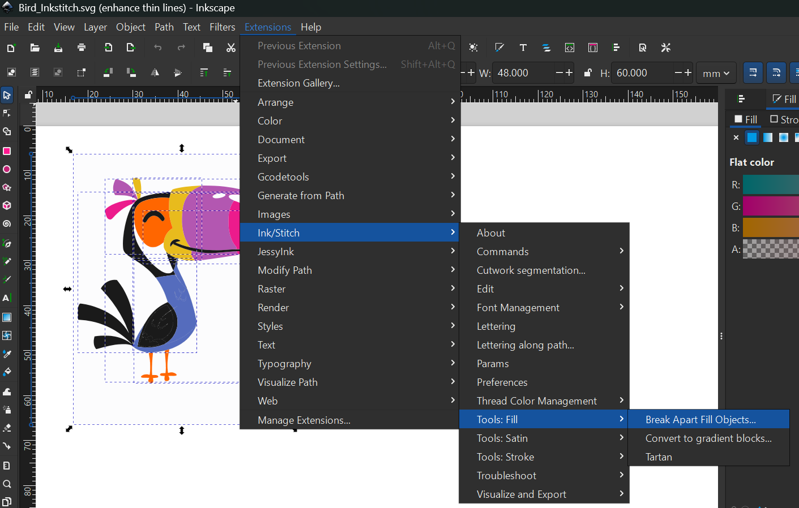

!!! info "Að skipta upp hópum"
    
     Smelltu á **Hlutur (Object)** og **Skipta upp hóp (Ungroup)**.

    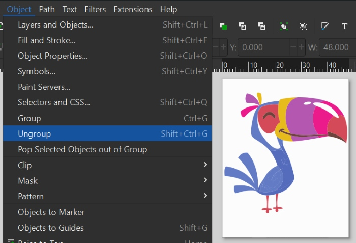

!!! info "Að fylla svæði með litum"
    
     Smelltu á **Hlutur (Object)** og **Skipta upp hóp (Ungroup)**.

     Veldu litlu málningarfötuna vinstra megin og veldu lit á litastikunni neðst. Smelltu svo á þann flöt sem þú vilt fylla með litnum.

!!! info "Stillingar fyrir fyllt svæði"
    
     Næst smellir þú á **Hlutur** og svo **Fylling og útlína**, kveiktu á **Fyllingu** og slökktu á **Lit útlínu**.
     

!!! info "Stærð á mynd"
    
     Stilltu hver stærðin á myndinni á að vera.

    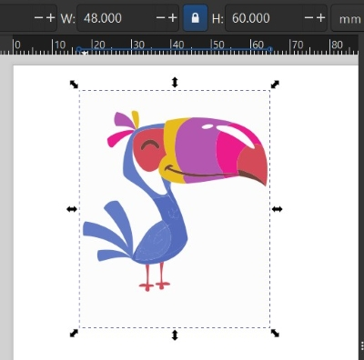

!!! info "Að aðlaga stærð að innihaldi"
    
     Smelltu á **Skrá** og **Skráareiginleikar**. Þar smellir þú á lítinn hnapp merktan **Aðlaga stærð að innihaldi**.

    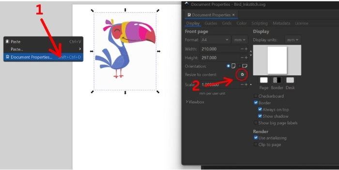

!!! info "Búið að aðlaga stærð að innihaldi"
    
     Eftir að stærðin hefur verið aðlöguð að innihaldi sést að blaðsíðan passar akkúrat utan um verkefnið.

!!! info "Stillingar og forskoðun í params"
    
    Ef þú smellir á **Extensions**, **Ink/Stitch**, **Params** getur þú skoðað stillingarnar fyrir útsauminn.

    Í params er meðal annars að finna forskoðun á útsaumsverkinu. Það spilast eins og myndband svo það sést hvernig útsaumurinn fer fram. Þarna er líka hægt að breyta ýmsum stillingum.

    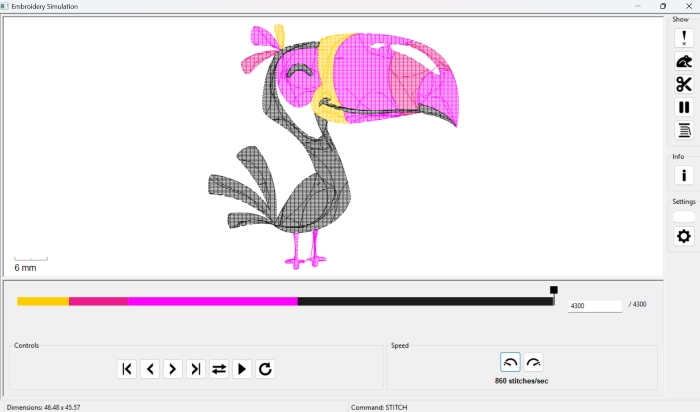

!!! info ".pes skrá býr til feril fyrir saumavél"
    
    Á myndinni hér fyrir neðan sést hvernig .pes hefur búið til feril fyrir útsaumsvélina. Þarna sést hvernig tvinninn verður lagður niður.

    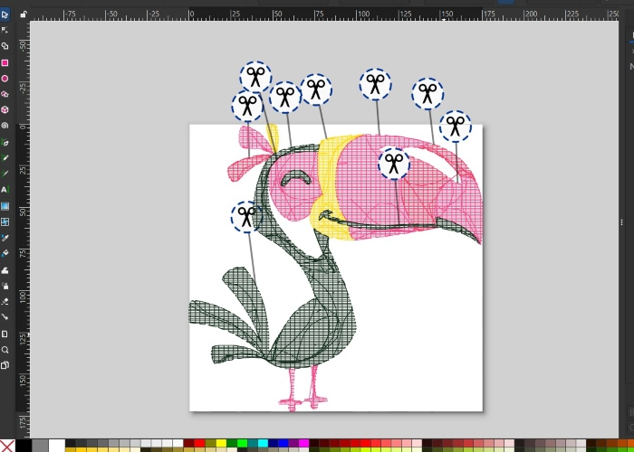
    
### Að búa til útlínumynd

!!! info "Að búa til útlínumynd fyrir útsaumsvélina"
    
     Ef þú vilt búa til útlínumynd getur þú fylgt leiðbeiningunum [hér](https://www.flr.is/_files/ugd/0ebced_1bd42ec7d77140aea1e74aec7377078f.pdf) í bókinni eftir Hafey Hallgrímsdóttur um hvernig eigi að búa til límmiða en þegar þú hefur smellt á **Hlutur** og **Fylling og útlína**, slökkt á **Fylling** og kveikt á **Litur útlínu**....þá, í stað þess að stilla **Stíll útlínu** á 0.02 gerir þú línuna þykkari. Það er gott a miða við að hafa línuna að lágmarki 1.5. Svo getur þú valið lit á línuna en þær stillingar eru svo endanlega gerðar í útsaumsvélinni síðar.

!!! info "Að nota Convert line to Satin"
    
     Næsta skref er að smella á **Extensions**, **Ink/Stitch**, **Tools: satin** og svo **Convert line to satin**.

!!! info "að vista sem .pes file"
    
    Næst er skráin vistuð sem **.svg** skrá. Þessa skrá er hægt að nota síðar ef það reynist þörf á að breyta hönuninni. Svo er skráin vistuð sem **.pes file**. 
    
!!! info ".pes skrá býr til útsaumsferilinn"
    
    Á myndinni hér fyrir neðans sést hvernig .pes skráin bjó til feril fyrir þetta verkefni. Þráðurinn sést vel.

### Að festa efnið á ramma

!!! info "Að festa efnið"
    
    Margnota taupoki var notaður í þetta verkefni. Efnið var fest í sérstakan útsaumsramma. Innri hluti útsaumsrammans var lagður innan í taupokann. Svo var bútur af stuðningsefni lagður ofan á rammann, semsagt einnig inni í pokanum. Það er mikilvægt að búturinn af stuðningsefninu sé nógu stór til að geta fallið á milli innri rammans og ytri rammans. Eftir að búið er að stilla af staðsetninguna á innri rammanum+stuðningsefninu er ytri ramminn lagður ofan á efnið og honum þrýst niður þannig að hann falli utan um innri rammann sem er hinum megin við efnið. Svo er skrúfan hert til að halda efninu á sínum stað. Þess er gætt að efnið sé nógu vel strekkt til að hægt sé að banka létt á efnið eins og trommu.

!!! tip "Röðun á lögum ræður röðun á útsaumi"
    
    Þegar unnið er með fleiri en einn litaflöt og línur í Inkscape verða til nokkur lög (e. layers) í Inkscape. Það er hægt að stýra því á hvaða litafleti vélin byrjar. Vélin byrjar ávallt á því lagi sem er neðst á listanum í Inkscape og fylgir svo lögunum uppávið. Þetta þýðir að þú getur breytt röðun laganna ef það skiptir máli í hvaða röð saumað er. Dragðu bara lögin til þar til röðunin er eins og óskað er eftir.

## FABL2GR05

### Að búa til mynstur (límmiðar/fatalímmiðar og fleira)

!!!Info "Að finna mynd á netinu"

    * Bættu orðinu **Silhouette** eða **Black and white** fyrir aftan leitarorðið þitt til að fá skýra, svart/hvíta mynd. 
    * Smelltu á **Mynd (Image)**. 
    * Smelltu svo á **Verkfæri (Tools)** 
    * Veldu Creative Commons leyfið.

    

    * Vistaðu myndina.

!!!Info "Að flytja myndina inn í Inkscape"

    * Opnaðu Inkscape forritið
    * Veldu **Skrá (File)** og **Flytja inn (Import)**. 
    * Veldu myndina og smelltu á **Opna (Open)**.
    * Smelltu á **Í lagi (OK)**.

!!!Info "Að búa til vektormynd"

    * Veldu **Ferill (Path)** og **Línuteikna bitamynd (Trace bitmap)**. 
    * Þegar smellt er á **Uppfæra (Update)** er sýnt hvernig myndin muni líta út. Reyndar gefur það ekki alltaf nákvæma mynd en oftast virkar það sem **Preview**. 
    * Smellið svo á **Í lagi (Apply)**. Í sumum tölvum stendur **Virkja** en ekki **Í lagi**. 
    * Vinstri-smelltu með músinni ofan á myndina, haltu takkanum inni og dragðu myndina til hliðar. 
    * Smellið til skiptis á báðar myndirnar. Þegar það stendur ,,Mynd“ (Image)  neðst á skjánum má eyða þeirri mynd. 

!!!Info "Að búa til mynstur í Inkscape"

    * Veldu myndina.
    * Smelltu á **Breyta (Edit)**, svo **Klóna (Clone)** og að lokum á **Búa til tíglaða klóna (Create tiled clones)**.

    

    * Á myndinn hér fyrir neðan sést hvernig búið er að nota litlu örina hægra megin til að velja **CM: speglun + spegilhliðrun**. Það sést einnig neðarlega að búið er að skrifa 4 raðir og 4 dálka. Útkoman sést á myndinni.  

    

    * Taktu eftir því að það eru örvar í kringum upphaflegu vektormyndina. Hún liggur í raun ofan á mynstrinu sem þú varst að búa til. Dragðu hana til hliðar. Þú getur notað þessa vektormynd til að prófa þig áfram með önnur mynstur. Prófaðu að nota örina og velja aðrar útfærslur

    

    * Veldu mynstrið sem þú vilt eiga. **Hægrismelltu á skjáinn** og veldu **Eiginleikar skjals (Document properties)**. 
    * Smelltu á **Aðlaga stærð að innihaldi (Resize to content)**.
    * Smelltu þrisvar á báða plúsana.
    * Færðu mynstrið inn á miðja blaðsíðuna.
    * Vistaðu skjalið sem **.svg og sem .pdf.**

### Að búa til límmiða í mörgum litum

!!!Example "Að finna mynd á netinu sem hægt er að hafa í nokkrum litum"

    * Bættu orðinu **Silhouette** eða **Black and white** fyrir aftan leitarorðið þitt til að fá skýra, svart/hvíta mynd. Leitaðu eftir mynd sem hægt er að gera í a.m.k. þremur litum.
    * Smelltu á **Mynd (Image)**. 
    * Smelltu svo á **Verkfæri (Tools)** 
    * Veldu **Creative Commons leyfið**.

    

    * Vistaðu myndina.

    * Ath! Þú getur líka leitað að mynd í lit en hún verður þá að vera mjög skýr með miklum andstæðum (contrast) á milli litaðra svæða. Þessi mynd hér fyrir neðan var tekin af slóðinni [hér](https://vectorportal.com/vector/skull-sticker/35973)

    Við viljum virða höfundarrétt og á þessari síðu er óskað eftir því að vísað sé í höfundinn og leyfið sem veitt er á þennan hátt:

    Image by <a href=" https://www.vectorportal.com" >Vectorportal.com</a>,  <a class="external text" href="https://creativecommons.org/licenses/by/4.0/" >CC BY</a>

    

!!!Example "Að flytja myndina inn í Inkscape"

    * Opnaðu Inkscape forritið
    * Veldu **Skrá (File)** og **Flytja inn (Import)**. 
    * Veldu myndina og smelltu á **Opna (Open)**.
    * Smelltu á **Í lagi (OK)**.

!!!Example "Að búa til vektormynd"

    * Veldu **Ferill (Path)** og **Línuteikna bitamynd (Trace bitmap)**. 
    * Þegar smellt er á **Uppfæra (Update)** er sýnt hvernig myndin muni líta út. Reyndar gefur það ekki alltaf nákvæma mynd en oftast virkar það sem **Preview**. 
    * Smellið svo á **Í lagi (Apply)**. Í sumum tölvum stendur **Virkja** en ekki **Í lagi**. 
    * Vinstri-smelltu með músinni ofan á myndina, haltu takkanum inni og dragðu myndina til hliðar. 
    * Smellið til skiptis á báðar myndirnar. Þegar það stendur ,,Mynd“ (Image)  neðst á skjánum má eyða þeirri mynd. 

    

!!!Example "Að sundra öllu"

    * Veldu myndina. 
    * Smelltu á **Ferill (Path)** og veldu **Sundra (Break apart)**. Þá verður myndin oft alveg svört en þá er til dæmis hægt að slökkva á fyllingunni og kveikja á línunni, sjá hér á eftir.
    * Smelltu á **Hlutur (Object)** og veldu **Fylling og útlína (Fill and stroke)**.
    * Smelltu á **Litur útlínu (Stroke paint)** og veldu **Flatur litur (Flat color – sem er skammstafað RGB)** og stilltu **rauðan í fullt (255)**. 
    * Smelltu á **Stíll útlínu (Stroke style)** og stilltu línurnar á **0.100mm**. Þá sjást allar línur vel á meðan unnið er með myndina. **Passaðu svo að muna eftir því að stilla línurnar seinna þannig að þær verði skurðarlínur. Það verður útskýrt betur seinna í verklýsingunni**.

    

!!!Example "Að búa til ferhyrning til viðmiðunar fyrir samsetningu"

    * Smelltu á kassatáknið og teiknaðu lítinn ferhyrning við hliðina á myndinni. (Sjá myndina hér fyrir ofan og svo nærmyndina af ferhyrningunum hér fyrir neðan).
    * Teiknaðu svo annan minni ferhyrning innan í. Stærri ferhyrningurinn verður að útlínum fyrir minni ferhyrninginn. Það koma betri útskýringar um notkun kassanna á eftir.

    

!!!Example "Að búa til sér skjal fyrir hvern lit"

    * Þessi límmiði á að vera í þremur litum og þess vegna þarf að búa til þrjú Inkscape skjöl. 
    * Hér fyrir neðan sést hvaða línur skera hvern lit. Undir línunum eru myndir af límmiðunum sem verða skornir út. Vinstra megin eru línurnar sem eiga að skera gulan, í miðjunni er línan sem á að skera svartan og til hægri eru línurnar sem eiga að skera hvítan. Gula hlutann þarf að skera tvisvar vegna þess að litlu bútarnir eiga að vera efst. **Mikilvægt!: Þessi mynd er einungis sett svona upp til að útskýra. Það má alls ekki færa línurnar í sundur, heldur þarf að vista eitt skjal fyrir hvern lit. Svo má eyða línum en alls ekki færa línurnar!**

    

    * Vistaðu eitt skjal fyrir hvern lit:
    * Farðu fyrst í **Skrá (File)** og veldu **Vista sem (Save as)** til að vista fyrsta skjalið í Inkscape. Gefðu skjalinu nafn, til dæmis **Hauskúpa_svört**.
    * Smelltu svo á **Skrá (File)** og veldu **Vista sem (Save as)** til að vista annað skjalið í Inkscape. Gefðu skjalinu nafn, til dæmis **Hauskúpa_hvít**.
    * Farðu svo aftur í **Skrá (File)** og veldu **Vista sem (Save as)** til að vista þriðja skjalið í Inkscape. Gefðu skjalinu nafn, til dæmis **Hauskúpa_gul**.
 
!!!Example "Skjal fyrir stærsta límmiðann/grunninn"

    * Skoðaðu myndina vel og veldu hvaða svæði hentar sem stærsti límmiðinn sem hinir límmiðarnir (hinir litirnir) verða límdir ofaná. Hér var ákveðið að það væri hentugt að velja ystu línuna og nota gulan sem grunn. 
    * Skjalið sem heitir **Hauskúpa_Gul** var opnað.
    * Þar var öllum línum úr hauskúpunni eytt nema ystu línunni. Hinir litirnir voru svo límdir ofan á þetta form þegar búið var að skera út límmiðana.
    * ATH! Þegar farið var að plokka burtu það sem á ekki að vera hjá þessum límmiða var passað að plokka litla ferhyrninginn innan úr stóra ferhyrningnum. **Semsagt: Í skjalinu fyrir stærsta límmiðann á að plokka litla ferhyrninginn innan úr stóra ferhyrningnum. Hér er það þá ljósblái ferhyrningurinn sem á að plokka burt af límmiðanum.**

    
    
    * Svo var smellt á **Skrá (File)** og **Skráareiginleikar (Document Properties)**. Svo var smellt á **Aðlaga stærð að innihaldi (Resize to content)** til að nýta efnið vel.
    * Svo voru skurðarlínur eins og lýst er hér neðar.

!!!Example "Að stilla skurðarlínur"

    Smelltu svo á **Hlutur (Object)** og veldu **Fylling og útlína (Fill and stroke)**. Veldu fyrst flipann sem er merktur **Fylling (Fill)**. Þar á að slökkva á fyllingunni með því að velja **X**.

    

    Veldu næst flipann sem er merktur **Litur útlínu (Stroke paint)** og kveiktu með því að **velja reitinn við hliðina á x-inu**. Stilltu svo rauða litinn á **255**.

    

    Veldu flipann sem er merktur **Stíll útlínu (Stroke style)** og stilltu breidd línunnar (width) á 0.02 mm.

    

!!!Example "Að stilla síðuna og vista skjalið"

    * **Hægrismelltu á skjáinn** og veldu **Eiginleikar skjals (Document properties)**. 
    * Veldu myndina.
    * Smelltu á **Aðlaga stærð að innihaldi (Resize to content)**.
    * Smelltu þrisvar á báða plúsana.
    * Færðu myndina inn á miðja blaðsíðuna.
    * Vistaðu skjalið sem **.svg og sem .pdf.**

!!!Example "Skjölin fyrir hina litina"

    * Opnaðu hin skjölin með skurðarlínunum fyrir hina litina. 
    * Eyddu öllum línum sem eiga ekki að vera.
    * Aðlagaðu stærð skjalsins að innihaldi, eins og gert var í fyrsta skjalinu.
    * Stilltu skurðarlínur, eins og gert var í fyrsta skjalinu.
    * Vistaðu skjalið sem **.svg** og sem **.pdf**, eins og í fyrsta skjalinu.
    * Þegar búið er að skera út límmiðana í þessum litum er stærri ferhyrningurinn plokkaður í burtu (dökkblái ferhyrningurinn sem sést hér fyrir neðan):

    

!!!Example "Límmiðabútum raðað saman"

    * Þegar búið er að skera út límmiðana í öllum litum er flutningsfilma notuð til að flytja límmiðabútana ofan á stóra límmiðann. 
    * Látið litla ferhyrninginn passa innan í stóra ferhyrninginn. Þannig lendir allt á réttum stað.

    

### Að búa til logo

!!!tip "Logo"

    Logo getur verið búið til úr texta og/eða mynd. Hér á eftir koma dæmi um hvernig hægt er að vinna með texta og form. Þegar þú hannar logo skaltu hafa í huga hvað þú vilt að fólk sjái fyrir sér þegar það sér logoið. Reyndu að hafa það skýrt og einfalt. Hugsaðu líka um hvaða litir falli best að hugmynd þinni og hvaða litir séu grípandi/áberandi. 

!!!tip "Texta breytt í feril"

    Smelltu á **A** (táknið fyrir texta) sem er á stikunni vinstra megin. Skrifaðu textann sem þú vilt hafa í logoinu. Veldu svo **Ferill (Path)** og því næst **Hlutur sem ferill (Object to path)**. 

    

!!!tip "Að nota Hnútaverkfæri (Node tool) til að breyta texta"

    Smelltu á táknið fyrir **Hnútaverkfæri (Node tool)**. Þá sérðu punkta sem hægt er að vinna með. Þessa punkta er hægt að draga til og frá. Á stikunni fyrir ofan sérðu meðal annars hvernig hægt er að bæta við punktum með plústákninu, fækka punktum með mínus, slíta tengsl á milli punkta og fleira. 

    

!!!tip "Að nota handföngin á punktunum til að beygja form"

    Smelltu á táknið sem örin bendir á. Hnappurinn heitir **Sýna Bezier-haldföng fyrir valda hnúta (Show Bezier handles for selected nodes)**. Þá sjást handföngin á punktunum og með því að færa handföngin til er hægt að breyta löguninni á forminu/bókstafnum.

    

!!!tip "Myndbönd sem sýna hvernig hægt er að vinna með letur"

    Hér fyrir neðan má finna myndbönd sem sýna hvernig hægt er að breyta letri í Inkscape á ýmsan hátt. Athugaðu að sum myndböndin spilast mjög hratt:

    [Hér](https://www.youtube.com/watch?v=BI8Nw69Vn5o) er myndband sem sýnir hvernig einn bókstafur í orði er stækkaður og hann látinn klippa af bókstöfunum við hliðina á honum.

    [Hér](https://www.youtube.com/shorts/em8nQeE5DJw) er myndband sem sýnir dæmi um hvernig hægt er að teygja til bókstafi.

    [Hér](https://www.youtube.com/shorts/xqJQoxrLJak) er myndband sem sýnir hvernig hægt er að láta texta fylgja formi til að ná fram fjarvídd.

    [Hér](https://www.youtube.com/shorts/uJny3tSsH-4) er myndband sem sýnir hvernig hægt er að fjölfalda form og snúa þeim til að búa til mynstur.

    [Hér](https://www.youtube.com/watch?v=BI8Nw69Vn5o) er myndband sem sýnir dæmi um hvernig hægt er að breyta letri í Inkscape.

### Að jafna og dreifa

!!!abstract "Að jafna og dreifa formum"

    Hægt er að raða formum jafnt á línu, bæði lóðrétt og lárétt. Oft er talað um að jafna á x-ás eða y-ás en það er til dæmis líka hægt að miða við efstu brún eða neðstu brún. Smelltu á **Hlutur (Object)** og svo **Jafna og dreifa (Align and distribute)**. 

    

    Hægra megin er hægt að velja hvaða svæði sé miðað við. Ef þú velur **Valsvæði**, eins og gert er á myndinn hér fyrir neðan, er einungis miðað við svæðið sem formin eru á. Annar möguleiki er til dæmis að velja að formin séu jöfnuð út miðað við blaðsíðu (Page) og þá verður formunum raðað miðað við blaðsíðuna/vinnusvæðið.

    

### Að sameina eða sundra formum á mismunandi hátt

#### Að færa form á milli laga (layers)

!!!tip "Að færa form á milli laga (layers)"

    Athugaðu að stundum skiptir máli hvort form liggur ofaná eða undir öðru formi. Því þarftu að vita hvernig á að færa form upp eða niður á milli laga. Veldu formið sem þú vilt færa. Smelltu á **Lag (layer)** og svo **Lög og hlutir (Layers and objects)**. Þar undir er hægt að velja að færa form upp og niður á milli laga.

    

#### Að bræða saman

!!!tip "Að bræða saman (Union)"

    Smellt var á **Ferill (Path)** og svo á **Bræða saman (Union)**. Þessi aðgerð bræðir saman tvö form þannig að þau verða að einu formi.

    

    Hér fyrir neðan sýnir efri myndin hvernig formin eiga eftir að skera hvert annað í sundur ef þau eru ekki brædd saman. Neðri myndin sýnir hvernig formin hafa verið brædd saman.

    

#### Mismunur (Difference)

!!!tip "Mismunur (Difference)"

    Hér voru búin til fjögur form og þau höfð í mismunandi litum. Hér var bláa stjarnan höfð ofaná sporöskjunni en bleika stjarnan höfð undir sporöskjunni. Þegar smellt var á **Ferill (Path)** og svo á **Mismunur (Difference)**. Efra formið eyðir þeim svæðum þar sem formið liggur ofan á neðra forminu.

    

#### Skörun (Intersection)

!!!tip "Skörun (Intersection)"

    Smellt var á **Ferill (Path)** og svo á **Skörun (Intersection)**. Formin skerast á nákvæmlega sama hátt, svo það skiptir ekki máli hvort formið er ofaná og hvort er undir. Einungis svæðið, sem bæði formin snertast á, verður eftir. Hitt eyðist. Nýju formin taka á sig lit formsins sem var undir.

    

#### Útilokun (Exclusion)

!!!tip "Útilokun (Exclusion)"

    Smellt var á **Ferill (Path)** og svo á **Útilokun (Exclusion)**. Formin skerast á nákvæmlega sama hátt, svo það skiptir ekki máli hvort formið er ofaná og hvort er undir. Svæðið, sem bæði formin snertast á, eyðist út. Nýju formin taka á sig lit formsins sem var undir.

    

#### Uppskipting (Division)

!!!tip "Uppskipting (Division)"

    Smellt var á **Ferill (Path)** og svo á **Uppskipting (Division)**. Á efri myndinni sést hvernig bleika formið klippir einungis það svæði af neðra forminu þar sem það liggur ofaná. 

    Á neðri myndinni sést að fjólubláa sporaskjan liggur ofaná og hún klippir einungis af svæðinu sem hún snertir.

    

    [Hér](https://www.youtube.com/shorts/6jVaVTWy6V4) er svo myndband sem sýnir hvernig hægt er að nota uppskiptingu (division).

#### Að klippa feril (Cut path)

!!!tip "Klippa feril (Cut path)"

    Smellt var á **Ferill (Path)** og svo á **Klippa feril (Cut path)**. Þessi aðgerð skilur einungis eftir neðra formið og býr til skurðarlínur inni í því þar sem efra formið lá. Það er því hægt að færa svæðin innan formsins í sundur, eins og sést á myndinni hér fyrir neðan. 
    
    Athugaðu að aðgerðin slekkur á litnum, svo það lítur út fyrir að formunum hafi verið eytt, því þau sjást ekki. Þegar kveikt er á litnum aftur sjást formin.

    

## Kom upp vandamál?

### Hönnunin hverfur þegar ég stilli línuþykktina á 0,02mm

!!! bug "Fyrsta athugun"

    Haltu niðri **CTRL** takkanum og snúðu músarhjólinu. Með því ertu að þysja inn þar sem músin þín er staðsett (örin á skjánum). Passaðu því að hafa músina þína á hönnuninni þinni. Sérðu línurnar þegar þú þysjar inn? Það er vegna þess að þær eru svo örmjóar að þær sjást varla þegar þær eru stilltar á 0,02mm. Ef þú sérð línurnar núna er allt í góðu og þú getur haldið áfram með það sem þú þarft að gera. 

!!! bug "Athugaðu þetta ef þú sást ekkert við fyrstu athugun"

    Athugaðu hvort það stendur 0,020 eða 0.000 í reitnum þar sem þú breyttir línunni. Ef það stendur 0.000 skaltu prófa að nota punkt en ekki kommu þegar þú skrifar aftur 0.020. Í sumum tölvum þarf að nota punkt. Vonandi birtist hönnunin þín við þetta.

    Kannski gleymdir þú bara að stilla **stíl útlínu (stroke style)** á 0,02. Kannski minnkaðir eða stækkaðir þú hönnunina eftir að búið var að stilla línuþykktina. Þá breytist þykktin á línunni. Mundu því að stilla alltaf línuþykktina upp á nýtt ef þú breytir stærðinni á einhverju í hönnuninni.
    
    

### Ekkert gerist þegar form er teiknað í Inkscape

!!! bug "Fyrsta athugun"

    Staðsettu músina þína aðeins fyrir ofan og til vinstri við svæðið sem þú varst að teikna á. Haltu músarhnappnum niðri og dragðu músina á ská niður yfir allt svæðið sem þú teiknaðir á. Þannig ertu að veiða formið/velja það. Smelltu svo á **Hlutur** og svo **Fylling og útlína**. Kveiktu á fyllingunni svona:

    Birtist formið núna? Það er vegna þess að það var slökkt á fyllingunni og línunni en núna er kveikt á fyllingunni.

    

!!! bug "Athugaðu þetta ef þú sást ekkert við fyrstu athugun"

    Athugaðu hvort það er búið að stilla **ógegnsæi(opacity)** á 0. Þá þarf að draga stikuna upp í 100%. Þú finnur þessa stiku neðst til hægri í Inkscape.

    Birtist formið núna? Það er vegna þess að liturinn var gegnsær en núna er hluturinn ekki gegnsær lengur. 

    

!!! bug "Þriðja athugun"

    Athugaðu hvort það er búið að stilla **Alpha (Alpha channel)** á 0. Þá þarf að draga stikuna upp í 100%. Þú finnur þessa stiku neðst undir stillingunum fyrir liti bæði undir flipanum fyrir **fyllingu** og **lit útlínu** í Inkscape. Hún er merkt með bókstafnum **A**.

    

### Vélin sker ekki skurðarlínurnar

!!! bug "Fyrsta athugun"

    Opnaðu hönnunina þína í Inkscape. Veldu hönnunina. Smelltu á **Hlutur** og svo **Fylling og útlína**. Smelltu á flipann sem er merktur sem **Stíll útlínu (stroke style)**. Athugaðu hvort línuþykktin er stillt á 0.02mm. Ef talan er önnur þarftu að breyta henni í 0.02. Svo þarftu að vista þetta aftur sem PDF skjal. Ef þú færð meldingu um að það sé ekki hægt, getur verið að gamla PDF skjalið sé enn opið. Þú þarft að loka því svo það sé hægt að vista breytingarnar.

    

!!! bug "Athugaðu þetta ef þú sást ekkert við fyrstu athugun"

    Athugaðu hvort það er búið að stilla **ógegnsæi(opacity)** á 0. Þá þarf að draga stikuna upp í 100%. Þú finnur þessa stiku neðst til hægri í Inkscape.

    Vélin vill alls ekki nota línur með gegnsæi, jafnvel þó **ógegnsæi (opacity)** sé bara pínulítið og næstum því 100%, til dæmis stillt á 99%, er það nóg til að vélin geti ekki skorið línuna. Passaðu því að skurðarlínur séu alltaf stilltar á 100%.

    
