# Leiðbeiningar um notkun hugbúnaðar og tækjabúnaðar

## Inkscape 

### Að opna og nota Inkscape forritið

!!!Info "Inkscape forritið"

    Með Inkscape forritinu er hægt að hanna ótrúlega margt, til dæmis límmiða sem hægt er að skera út úr vínyl í vínylskera. Það er líka hannað eitthvað til að skera og rastera í laser. Neðar á síðunni, á hlekknum fyrir *Kennslubækur, kennslumyndbönd og leiðbeiningar* er kennsluefni fyrir Inkscape hjá efni fyrir vínylskera og laserskera.

!!! Info "Að opna Inkscape"

    Ef þú sérð ekki táknið getur þú skrifað Inkscape í leitargluggann neðst á skjánum.

    

!!! Info "Tvísmellið á táknið"

    Tvísmelltu svo á táknið þegar þú sérð það. Stundum er forritið lengi að opnast svo það er gott að bíða smástund til að sjá hvort það opnist. Annars tvísmellir þú aftur.

    

### Að skipta um tungumál í Inkscape

!!! Tip "Íslenska eða annað tungumál"

    Það er hægt að skipta um tungumál í Inkscape en **það þarf að loka forritinu þegar búið er að skipta um tungumál og opna forritið svo aftur**. Smelltu á **Breyta** og svo **Kjörstillingar**. Hér fyrir neðan sérðu hvernig þetta lítur út þegar forritið er stillt á íslensku og þegar það er stillt á ensku.

               

!!! Tip "Íslenska eða annað tungumál - framhald"

    Því næst smellir þú á Viðmót (á ensku er það Interface) og þá sérðu hvar þú getur valið tungumál. Mundu svo að loka forritinu og opna það aftur.

                

## Að búa til límmiða, fatalímmiða, endurskinsmerki og gluggafilmur

### Kennslubækur og myndbönd

!!! Example "Leiðbeiningar"
    
    Á vefsíðunni [Fabmennt.com](https://www.fabmennt.com/) er að finna kennslumyndbönd og leiðbeiningar. Þar er einnig að finna kennslubækur með leiðbeiningum um notkun vínylskera, laserskera (geislaskera) og um þrívíddarhönnun. *Bækurnar gerði Hafey Viktoría Hallgrímsdóttir hjá Fab Lab Reykjavík.
    
    

    

!!! Example "Leiðbeiningar um gerð límmiða, fatalímmiða og gluggafilmu"
    
    Smelltu [hér](https://www.fabmennt.com/leidbeiningarvinyl) til að skoða leiðbeiningar um hvernig hægt er að búa til límmiða, fatalímmiða, endurskinsmerki og gluggafilmu í vínylskera. *Höfundar: Hafey Viktoría Hallgrímsdóttir og Þóra Óskarsdóttir.*

!!! Example "Myndbönd um gerð límmiða, fatalímmiða og gluggafilmu"
    
    Smelltu [hér](https://www.fabmennt.com/myndbondvinyl) til að skoða kennslumyndbönd um hvernig hægt er að búa til límmiða, fatalímmiða, endurskinsmerki og gluggafilmu í vínylskera. *Höfundar: Andri Sæmundsson og Hafey Viktoría Hallgrímsdóttir.*

### Nokkur verkefni

#### Að búa til mynstur (límmiðar/fatalímmiðar og fleira)

!!!Info "Að finna mynd á netinu"

    * Bættu orðinu **Silhouette** eða **Black and white** fyrir aftan leitarorðið þitt til að fá skýra, svart/hvíta mynd. 
    * Smelltu á **Mynd (Image)**. 
    * Smelltu svo á **Verkfæri (Tools)** 
    * Veldu Creative Commons leyfið.

    

    * Vistaðu myndina.

!!!Info "Að flytja myndina inn í Inkscape"

    * Opnaðu Inkscape forritið
    * Veldu **Skrá (File)** og **Flytja inn (Import)**. 
    * Veldu myndina og smelltu á **Opna (Open)**.
    * Smelltu á **Í lagi (OK)**.

!!!Info "Að búa til vektormynd"

    * Veldu **Ferill (Path)** og **Línuteikna bitamynd (Trace bitmap)**. 
    * Þegar smellt er á **Uppfæra (Update)** er sýnt hvernig myndin muni líta út. Reyndar gefur það ekki alltaf nákvæma mynd en oftast virkar það sem **Preview**. 
    * Smellið svo á **Í lagi (Apply)**. Í sumum tölvum stendur **Virkja** en ekki **Í lagi**. 
    * Vinstri-smelltu með músinni ofan á myndina, haltu takkanum inni og dragðu myndina til hliðar. 
    * Smellið til skiptis á báðar myndirnar. Þegar það stendur ,,Mynd“ (Image)  neðst á skjánum má eyða þeirri mynd. 

!!!Info "Að búa til mynstur í Inkscape"

    * Veldu myndina.
    * Smelltu á **Breyta (Edit)**, svo **Klóna (Clone)** og að lokum á **Búa til tíglaða klóna (Create tiled clones)**.

    

    * Á myndinn hér fyrir neðan sést hvernig búið er að nota litlu örina hægra megin til að velja **CM: speglun + spegilhliðrun**. Það sést einnig neðarlega að búið er að skrifa 4 raðir og 4 dálka. Útkoman sést á myndinni.  

    

    * Taktu eftir því að það eru örvar í kringum upphaflegu vektormyndina. Hún liggur í raun ofan á mynstrinu sem þú varst að búa til. Dragðu hana til hliðar. Þú getur notað þessa vektormynd til að prófa þig áfram með önnur mynstur. Prófaðu að nota örina og velja aðrar útfærslur

    

    * Veldu mynstrið sem þú vilt eiga. **Hægrismelltu á skjáinn** og veldu **Eiginleikar skjals (Document properties)**. 
    * Smelltu á **Aðlaga stærð að innihaldi (Resize to content)**.
    * Smelltu þrisvar á báða plúsana.
    * Færðu mynstrið inn á miðja blaðsíðuna.
    * Vistaðu skjalið sem **.svg og sem .pdf.**

#### Að búa til límmiða í mörgum litum

!!!Example "Að finna mynd á netinu sem hægt er að hafa í nokkrum litum"

    * Bættu orðinu **Silhouette** eða **Black and white** fyrir aftan leitarorðið þitt til að fá skýra, svart/hvíta mynd. Leitaðu eftir mynd sem hægt er að gera í a.m.k. þremur litum.
    * Smelltu á **Mynd (Image)**. 
    * Smelltu svo á **Verkfæri (Tools)** 
    * Veldu **Creative Commons leyfið**.

    

    * Vistaðu myndina.

    * Ath! Þú getur líka leitað að mynd í lit en hún verður þá að vera mjög skýr með miklum andstæðum (contrast) á milli litaðra svæða. Þessi mynd hér fyrir neðan var tekin af slóðinni [hér](https://vectorportal.com/vector/skull-sticker/35973)

    Við viljum virða höfundarrétt og á þessari síðu er óskað eftir því að vísað sé í höfundinn og leyfið sem veitt er á þennan hátt:

    Image by <a href=" https://www.vectorportal.com" >Vectorportal.com</a>,  <a class="external text" href="https://creativecommons.org/licenses/by/4.0/" >CC BY</a>

    

!!!Example "Að flytja myndina inn í Inkscape"

    * Opnaðu Inkscape forritið
    * Veldu **Skrá (File)** og **Flytja inn (Import)**. 
    * Veldu myndina og smelltu á **Opna (Open)**.
    * Smelltu á **Í lagi (OK)**.

!!!Example "Að búa til vektormynd"

    * Veldu **Ferill (Path)** og **Línuteikna bitamynd (Trace bitmap)**. 
    * Þegar smellt er á **Uppfæra (Update)** er sýnt hvernig myndin muni líta út. Reyndar gefur það ekki alltaf nákvæma mynd en oftast virkar það sem **Preview**. 
    * Smellið svo á **Í lagi (Apply)**. Í sumum tölvum stendur **Virkja** en ekki **Í lagi**. 
    * Vinstri-smelltu með músinni ofan á myndina, haltu takkanum inni og dragðu myndina til hliðar. 
    * Smellið til skiptis á báðar myndirnar. Þegar það stendur ,,Mynd“ (Image)  neðst á skjánum má eyða þeirri mynd. 

    

!!!Example "Að sundra öllu"

    * Veldu myndina. 
    * Smelltu á **Ferill (Path)** og veldu **Sundra (Break apart)**. Þá verður myndin oft alveg svört en þá er til dæmis hægt að slökkva á fyllingunni og kveikja á línunni, sjá hér á eftir.
    * Smelltu á **Hlutur (Object)** og veldu **Fylling og útlína (Fill and stroke)**.
    * Smelltu á **Litur útlínu (Stroke paint)** og veldu **Flatur litur (Flat color – sem er skammstafað RGB)** og stilltu **rauðan í fullt (255)**. 
    * Smelltu á **Stíll útlínu (Stroke style)** og stilltu línurnar á **0.100mm**. Þá sjást allar línur vel á meðan unnið er með myndina. **Passaðu svo að muna eftir því að stilla línurnar seinna þannig að þær verði skurðarlínur. Það verður útskýrt betur seinna í verklýsingunni**.

    

!!!Example "Að búa til ferhyrning til viðmiðunar fyrir samsetningu"

    * Smelltu á kassatáknið og teiknaðu lítinn ferhyrning við hliðina á myndinni. (Sjá myndina hér fyrir ofan og svo nærmyndina af ferhyrningunum hér fyrir neðan).
    * Teiknaðu svo annan minni ferhyrning innan í. Stærri ferhyrningurinn verður að útlínum fyrir minni ferhyrninginn. Það koma betri útskýringar um notkun kassanna á eftir.

    

!!!Example "Að búa til sér skjal fyrir hvern lit"

    * Þessi límmiði á að vera í þremur litum og þess vegna þarf að búa til þrjú Inkscape skjöl. 
    * Hér fyrir neðan sést hvaða línur skera hvern lit. Undir línunum eru myndir af límmiðunum sem verða skornir út. Vinstra megin eru línurnar sem eiga að skera gulan, í miðjunni er línan sem á að skera svartan og til hægri eru línurnar sem eiga að skera hvítan. Gula hlutann þarf að skera tvisvar vegna þess að litlu bútarnir eiga að vera efst. **Mikilvægt!: Þessi mynd er einungis sett svona upp til að útskýra. Það má alls ekki færa línurnar í sundur, heldur þarf að vista eitt skjal fyrir hvern lit. Svo má eyða línum en alls ekki færa línurnar!**

    

    * Vistaðu eitt skjal fyrir hvern lit:
    * Farðu fyrst í **Skrá (File)** og veldu **Vista sem (Save as)** til að vista fyrsta skjalið í Inkscape. Gefðu skjalinu nafn, til dæmis **Hauskúpa_svört**.
    * Smelltu svo á **Skrá (File)** og veldu **Vista sem (Save as)** til að vista annað skjalið í Inkscape. Gefðu skjalinu nafn, til dæmis **Hauskúpa_hvít**.
    * Farðu svo aftur í **Skrá (File)** og veldu **Vista sem (Save as)** til að vista þriðja skjalið í Inkscape. Gefðu skjalinu nafn, til dæmis **Hauskúpa_gul**.
 
!!!Example "Skjal fyrir stærsta límmiðann/grunninn"

    * Skoðaðu myndina vel og veldu hvaða svæði hentar sem stærsti límmiðinn sem hinir límmiðarnir (hinir litirnir) verða límdir ofaná. Hér var ákveðið að það væri hentugt að velja ystu línuna og nota gulan sem grunn. 
    * Skjalið sem heitir **Hauskúpa_Gul** var opnað.
    * Þar var öllum línum úr hauskúpunni eytt nema ystu línunni. Hinir litirnir voru svo límdir ofan á þetta form þegar búið var að skera út límmiðana.
    * ATH! Þegar farið var að plokka burtu það sem á ekki að vera hjá þessum límmiða var passað að plokka litla ferhyrninginn innan úr stóra ferhyrningnum. **Semsagt: Í skjalinu fyrir stærsta límmiðann á að plokka litla ferhyrninginn innan úr stóra ferhyrningnum. Hér er það þá ljósblái ferhyrningurinn sem á að plokka burt af límmiðanum.**

    
    
    * Svo var smellt á **Skrá (File)** og **Skráareiginleikar (Document Properties)**. Svo var smellt á **Aðlaga stærð að innihaldi (Resize to content)** til að nýta efnið vel.
    * Svo voru skurðarlínur eins og lýst er hér neðar.

!!!Example "Að stilla skurðarlínur"

    Smelltu svo á **Hlutur (Object)** og veldu **Fylling og útlína (Fill and stroke)**. Veldu fyrst flipann sem er merktur **Fylling (Fill)**. Þar á að slökkva á fyllingunni með því að velja **X**.

    

    Veldu næst flipann sem er merktur **Litur útlínu (Stroke paint)** og kveiktu með því að **velja reitinn við hliðina á x-inu**. Stilltu svo rauða litinn á **255**.

    

    Veldu flipann sem er merktur **Stíll útlínu (Stroke style)** og stilltu breidd línunnar (width) á 0.02 mm.

    

!!!Example "Að stilla síðuna og vista skjalið"

    * **Hægrismelltu á skjáinn** og veldu **Eiginleikar skjals (Document properties)**. 
    * Veldu myndina.
    * Smelltu á **Aðlaga stærð að innihaldi (Resize to content)**.
    * Smelltu þrisvar á báða plúsana.
    * Færðu myndina inn á miðja blaðsíðuna.
    * Vistaðu skjalið sem **.svg og sem .pdf.**

!!!Example "Skjölin fyrir hina litina"

    * Opnaðu hin skjölin með skurðarlínunum fyrir hina litina. 
    * Eyddu öllum línum sem eiga ekki að vera.
    * Aðlagaðu stærð skjalsins að innihaldi, eins og gert var í fyrsta skjalinu.
    * Stilltu skurðarlínur, eins og gert var í fyrsta skjalinu.
    * Vistaðu skjalið sem **.svg** og sem **.pdf**, eins og í fyrsta skjalinu.
    * Þegar búið er að skera út límmiðana í þessum litum er stærri ferhyrningurinn plokkaður í burtu (dökkblái ferhyrningurinn sem sést hér fyrir neðan):

    

!!!Example "Límmiðabútum raðað saman"

    * Þegar búið er að skera út límmiðana í öllum litum er flutningsfilma notuð til að flytja límmiðabútana ofan á stóra límmiðann. 
    * Látið litla ferhyrninginn passa innan í stóra ferhyrninginn. Þannig lendir allt á réttum stað.

    

#### Að búa til límmiða í BN-20 litaprentaranum

!!!Success "Að finna mynd á netinu"

    * Leitaðu að einhverju spennandi á netinu. 
    * Smelltu á **Mynd (Image)**. 
    * Smelltu svo á **Verkfæri (Tools)** 
    * Veldu Creative Commons leyfið.

    

    * Vistaðu myndina í möppunni þinni.

!!!Success "Að flytja myndina inn í Inkscape"

    * Opnaðu Inkscape forritið
    * Veldu **Skrá (File)** og **Flytja inn (Import)**. 
    * Veldu myndina og smelltu á **Opna (Open)**.
    * Smelltu á **Í lagi (OK)**.

!!!Success "Að stilla stærðina á myndinni"

    * Veldu myndina með því að smella á hana.
    * Hafðu lásinn fyrir ofan myndina lokaðan.
    * Stilltu stærðina á myndinni. Hér er hæðin til dæmis stillt á 50mm.

    

!!!Success "Að láta vinnusvæðið (blaðsíðuna) passa utan um myndina - skref 1"

    Þegar hönnunin er tilbúin er blaðsíðan oft stærri en það sem þið ætlið að búa til. Þá er gott að minnka blaðsíðuna til að efnið nýtist betur. Það gerið þið svona:

    * Hægrismellið á skjáinn og veljið **Eiginleikar skjals (Document properties)**. 
    * Ef það virkar ekki er hægt að smella á **Skrá (File) og Skráareiginleikar (Document Properties)**. 

    

   
!!!Success "Að láta vinnusvæðið (hvítu blaðsíðuna) passa undir myndina - skref 2"

    * Smellið svo á litla hnappinn hægra megin við **Aðlaga stærð að innihaldi (Resize to content).** Þá minnkar hvíta svæðið þannig að það passar nákvæmlega utan um hönnunina. 

    

!!!Success "Vinnusvæðið aðlagað og tilbúið"

    * Nú sjáið þið að vinnusvæðið (hvíta blaðsíðan) er bara undir myndinni.

    

!!!Success "Að vista verkefnið"

    Veldu **File** og svo **Save As**. Vistaðu svo verkefnið sem **.pdf** skjal.

## Laserskurðarvél (geislaskeri) - rasterað eða skorið úr plexígleri, timbri og fleiru

!!! Example "Leiðbeiningar um gerð glasamottu, Halloween skreytinga, lyklakippu, jólaskrauts og fleira"
    
    Smellið [hér](https://www.fabmennt.com/leidbeiningargeisla) til að skoða leiðbeiningar um hvernig hægt er að búa til glasamottu, Halloween skreytinga, lyklakippu, jólaskrauts og fleira. *Höfundar: Hafey Viktoría Hallgrímsdóttir og Þóra Óskarsdóttir.*

!!! Example "Myndbönd um gerð glasamottu, lyklakippu, jólaskrauts og fleira"
    
    Smellið [hér](https://www.fabmennt.com/myndbondgeisla) til að skoða kennslumyndbönd um hvernig hægt er að búa til glasamottu, lyklakippu, jólaskraut, kassa og fleira. *Höfundur: Andri Sæmundsson.*

### Þrívíddarhönnun og þrívíddarprentun

#### Ýmis hugtök útskýrð

!!! Example "Algengar aðgerðir í þrívíddarhönnun útskýrðar"
    
    Smellið [hér](https://www.youtube.com/watch?v=ouvf-4wciak) til að horfa á myndband sem útskýrir ýmsar aðgerðir sem notaðar eru þegar verið er að hanna hluti í 3D.

     

#### Tinkercad

!!! Example "Leiðbeiningar um þrívíddarprentun og hönnun þrívíðra hluta"
    
    Smellið [hér](https://www.fabmennt.com/leidbeiningar3d) til að skoða leiðbeiningar um hvernig hægt er að hanna þrívíða hluti og prenta þá út. *Höfundur: Hafey Viktoría Hallgrímsdóttir.*

!!! Example "Kennslumyndbönd um gerð þrívíðra hluta"
    
    Smellið [hér](https://www.fabmennt.com/myndbond3d) til að skoða leiðbeiningar um hvernig hægt er að hanna þrívíða hluti. *Höfundur: Andri Sæmundsson.*

!!! Example "Kennslumyndbönd um þrívíddarhönnun í Tinkercad"
    
    Á vefsíðu Fab Lab Ísland er að finna kennslumyndbönd um þrívíddarhönnun í Tinkercad. Smellið [hér](https://fablab.is/fablab-kennsluefni/hugbunadur/tinkercad/) til að skoða leiðbeiningar um hvernig hægt er að hanna þrívíða hluti í Tinkercad forritinu. *Höfundur: Vilhjálmur Magnússon.*

#### SketchUp

!!! Example "Kennslumyndbönd um þrívíddarhönnun í SketchUp"
    
    Á vefsíðu Fab Lab Ísland er að finna kennslumyndbönd um þrívíddarhönnun í SketchUp. Smellið [hér](https://fablab.is/fablab-kennsluefni/hugbunadur/sketchup/) til að skoða leiðbeiningar um hvernig hægt er að hanna þrívíða hluti í SketchUp forritinu. *Höfundur: Vilhjálmur Magnússon.*

#### Fusion 360

!!! Example "Kennslumyndbönd um þrívíddarhönnun í Fusion 360"
    
    Á vefsíðu Fab Lab Ísland er að finna kennslumyndbönd um þrívíddarhönnun í Fusion 360. Smellið [hér](https://fablab.is/fablab-kennsluefni/hugbunadur/sketchup/) til að skoða leiðbeiningar um hvernig hægt er að hanna þrívíða hluti í Fusion 360 forritinu. *Höfundur: Vilhjálmur Magnússon.*

#### Slicer for Fusion 360

!!! Example "Kennslumyndband um notkun Slicer for Fusion 360"
    
    Á vefsíðu Fab Lab Ísland er að finna kennslumyndbönd um hvernig hægt sé að umbreyta þrívíddarskrám þannig að módel sé sneitt niður. Smellið [hér](https://fablab.is/fablab-kennsluefni/hugbunadur/sketchup/) til að skoða leiðbeiningar um hvernig hægt er að umbreyta þrívíðum hlut í sneiðar í Slicer for Fusion 360 forritinu. *Höfundur: Vilhjálmur Magnússon.*

## Útsaumsvél

## Útsaumur og Inkstitch

Hér er unnið með ,,Extension" í Inskscape sem kallast Inkstitch. Notuð er teiknuð mynd af hákarli. Einnig er unnið með logo til að sjá hvernig hægt er að nota ,,Offset" svo útlína verði ekki saumuð yfir fyllingu. Hér eru útskýringar á verkferlinu.

### Bæklingur og leiðbeiningar

!!! example "Bæklingur fyrir Brother PR-680W 6-nála útsaumsvél"
    
    Fab Lab Austurland á Brother PR-680W 6-nála útsaumsvél. 
    Hér er [bæklingur](https://download.brother.com/welcome/doch102285/884t23_om01en.pdf) um útsaumsvélina. 

!!! example "Dropi af olíu áður en unnið er með vélina"
    
    * Það er mikilvægt að setja dropa af olíu á krókinn áður en neðri tvinninn er settur í. 
    
    * Þetta borgar sig að gera einu sinni á dag þá daga sem á að vinna með vélina, þ.e. áður en verkið hefst.

    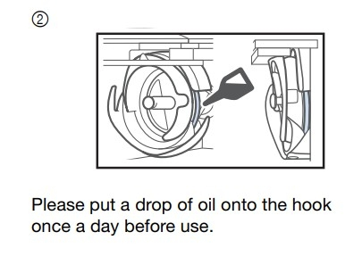

!!! example "Niðurhal og leiðbeiningar"
    
    Hægt er að sækja Inkstitch extension [hér](https://inkstitch.org/docs/install/). 
    
    [Hér](https://www.brother-usa.com/products/pr680w?srsltid=AfmBOooVz6D1Qg1xH7Wp5b3vJmmYAfjZst4mKufn2EUSffsu4XYdvi7v) má finna fleiri upplýsingar og leiðbeiningar um vélina.

### Kennslumyndbönd

!!! example "Leiðbeiningarmyndbönd fyrir saumavélina"
    
     Grunnleiðbeiningar [hér](https://www.youtube.com/watch?v=W7u4mPaRjIs).

     Leiðbeiningar fyrir fyllt svæði [hér](https://www.youtube.com/watch?v=a3-qerPiJy4).

     Leiðbeiningar fyrir línur (satin stitch) [hér](https://www.youtube.com/watch?v=Sqy_QTgPYH4).

### Að útbúa mynd fyrir saumavélina

!!!example "Að finna mynd á netinu"

    * Bættu orðinu **Silhouette** eða **Black and white** fyrir aftan leitarorðið þitt til að fá skýra, svart/hvíta mynd. 
    * Smelltu á **Mynd (Image)**. 
    * Smelltu svo á **Verkfæri (Tools)** 
    * Veldu Creative Commons leyfið.

    

    * Vistaðu myndina.

!!!example "Að flytja myndina inn í Inkscape"

    * Opnaðu Inkscape forritið
    * Veldu **Skrá (File)** og **Flytja inn (Import)**. 
    * Veldu myndina og smelltu á **Opna (Open)**.
    * Smelltu á **Í lagi (OK)**.

!!!example "Að breyta mynd í vektormynd"

    * Veldu **Ferill (Path)** og **Línuteikna bitamynd (Trace bitmap)**. 
    * Þegar smellt er á **Uppfæra (Update)** er sýnt hvernig myndin muni líta út. Reyndar gefur það ekki alltaf nákvæma mynd en oftast virkar það sem **Preview**. 
    * Smelltu svo á **Í lagi (Apply)**. Í sumum tölvum stendur **Virkja**. 
    * Vinstri-smelltu með músinni ofan á myndina, haltu takkanum inni og dragðu myndina til hliðar. 
    * Smelltu til skiptis á báðar myndirnar. Þegar það stendur ,,Mynd“ (Image)  neðst á skjánum má eyða þeirri mynd. 

!!! example "Það má líka nota eigin teikningar!"
    
     * Hér var pennateikningu notuð.

    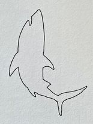

!!! example "Að stilla stærðina á myndinni"
    
     * Stilltu hversu stór útsaumaða myndin á að vera. 

     * Ef þú vilt að hlutföllin haldist rétt þegar stærðinni er breytt skaltu hafa lásinn lokaðan (þú smellir bara á lásinn til að opna eða loka honum).
     
     * Athugaðu að stærðin er í millimetrum. 

    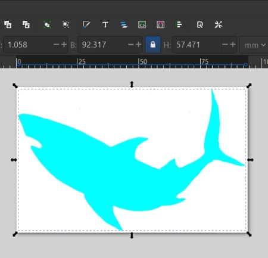  

#### Valið á milli þess að hafa fyllt svæði og/eða línur

!!! example "Fylling/lína eða bæði"

    Það er hægt að velja hvort það á bara að sauma útlínur eða hvort svæði eru fyllt. Það er einnig hægt að hafa bæði fyllingu og útlínu.

!!! example "Fyllt svæði"
    
     * Hér má sjá hvernig fylling er notuð.

     * Smelltu á **Hlutur (Object)** og svo **Fylling og útlína (Fill and stroke).** 
     
     * Veldu flipann sem merktur er **Fylling** og kveiktu á **Fyllingu**.
     
     * Veldu flipann sem merktur er **Litur útlínu (Stroke paint)** og slökktu á **Lit útlínu**.
     
     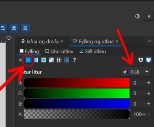

     * Það er gott að velja réttan lit úr litastikunni neðst á skjánum en litirnir (tvinninn) eru svo valdir endanlega í útsaumsvélinni. 

    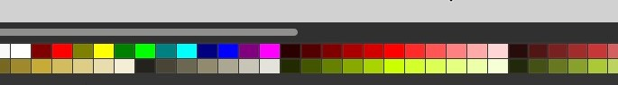

!!! example "Línur notaðar"
    
     * Hér má sjá hvernig línur eru notaðar.

     * Þá smellir þú á **Hlutur** og svo **Fylling og útlína**, slökktu á **Fyllingu** og kveiktu á **Lit útlínu**.
     
     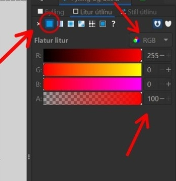

     * Það er gott að velja réttan lit úr litastikunni neðst á skjánum en litirnir (tvinninn) eru svo valdir endanlega í útsaumsvélinni. 

    

!!! example "Að aðlaga stærð að innihaldi"

     * Smelltu á **Skrá (File)** og **Skráareiginleikar (Document properties)**. 
     
     * Þar smellir þú á lítinn hnapp merktan **Aðlaga stærð að innihaldi (Resise to content)**.

    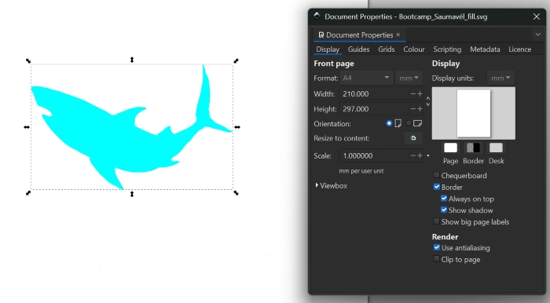

!!! example "Stillingar og forskoðun í params"
    
    * Ef þú smellir á **Extensions**, svo **Ink/Stitch** og að lokum **Params** getur þú séð forskoðun og stillingarnar fyrir útsauminn.

    * Það spilast eins og myndband svo það sést hvernig útsaumurinn fer fram.

    * Þarna er líka hægt að breyta ýmsum stillingum.
    
    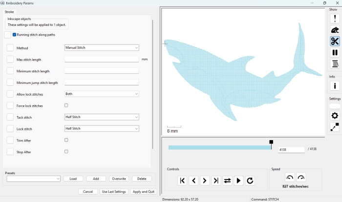

!!! example ".pes skrá býr til feril fyrir saumavél"
    
    * Veldu **Skrá (File)** og **Vista (Save)** til að vista allar breytingar sem þú hefur gert í Inkscape. Þessari .svg skrá getur þú svo breytt síðar ef það reynist þörf á að breyta hönnuninni.

    * Veldu svo **Skrá (File)** og **Vista sem (Save as)** og veldu **.pes**

    * Færðu svo þessa .pes skrá yfir á minnislykil og stingdu minnislyklinum í útsaumsvélina.

    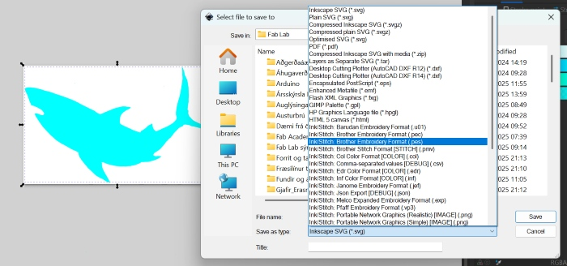
    
### Að búa til útlínumynd

!!! info "Að búa til útlínumynd fyrir útsaumsvélina"

!!! example "Línur notaðar"
    
     * Hér má sjá hvernig línur eru notaðar.

     * Þá smellir þú á **Hlutur (Object)** og svo **Fylling og útlína (Fill and stroke).**
     
     * Veldu flipann sem merktur er **Fylling** og slökktu á **Fyllingu**.
     
     * Veldu flipann sem merktur er **Litur útlínu (Stroke paint)** og kveiktu á **Lit útlínu**.
     
     

     * Það er fínt a miða við að hafa línuna að lágmarki 1.5mm.
     
     * Það er gott að velja réttan lit úr litastikunni neðst á skjánum en litirnir (tvinninn) eru svo valdir endanlega í útsaumsvélinni. 

    

!!! info "Að nota Convert line to Satin"
    
    * Næsta skref er að smella á **Extensions**, **Ink/Stitch**, **Tools: satin** og svo **Convert line to satin**.

    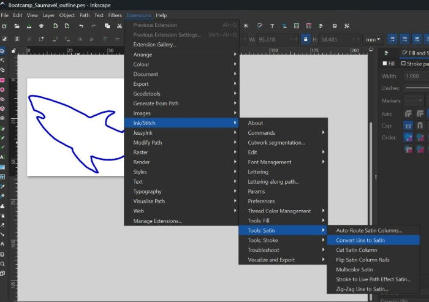

!!! example ".pes skrá býr til feril fyrir saumavél"
    
    * Veldu **Skrá (File)** og **Vista (Save)** til að vista allar breytingar sem þú hefur gert í Inkscape. Þessari .svg skrá getur þú svo breytt síðar ef það reynist þörf á að breyta hönnuninni.

    * Veldu svo **Skrá (File)** og **Vista sem (Save as)** og veldu **.pes**

    * Færðu svo þessa .pes skrá yfir á minnislykil og stingdu minnislyklinum í útsaumsvélina.

    

### Að festa efnið á ramma

!!! tip "Að festa efnið"
    
    * Festið efnið í sérstakan útsaumsramma. 
    
    * Innri hluti útsaumsrammans er lagður **innan í taupokann.** 
    
    * Svo er bútur af stuðningsefni lagður ofan á rammann innan í pokanum. Það er mikilvægt að búturinn af stuðningsefninu sé nógu stór til að geta fallið á milli innri rammans og ytri rammans. 

    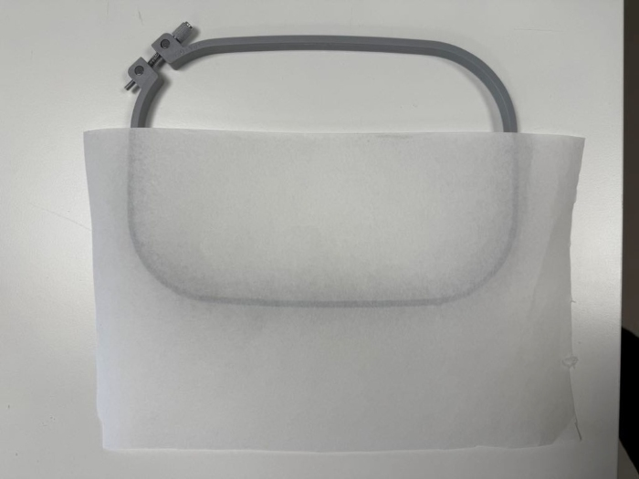
    
    * Eftir að búið er að stilla af staðsetninguna á innri rammanum+stuðningsefninu er ytri ramminn lagður ofan á efnið og honum þrýst niður þannig að hann falli utan um innri rammann sem er hinum megin við efnið. 
    
    * Svo er skrúfan hert til að halda efninu á sínum stað. 
    
    * Þess er gætt að efnið sé nógu vel strekkt til að hægt sé að banka létt á efnið eins og trommu.

    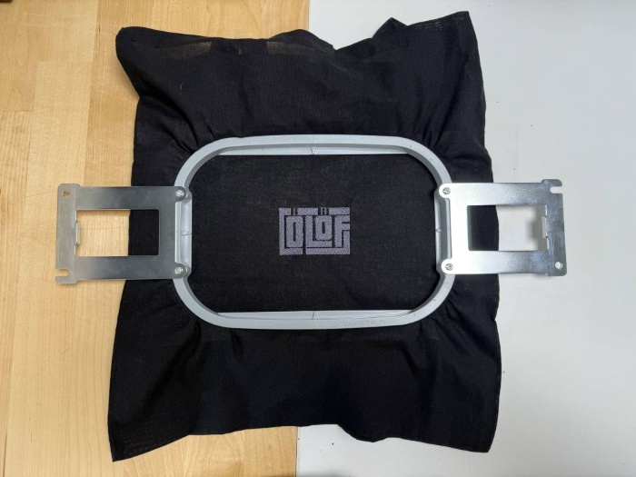

!!! tip "Röðun á lögum ræður röðun á útsaumi"
    
    Þegar unnið er með fleiri en einn litaflöt og línur í Inkscape verða til nokkur lög (e. layers) í Inkscape. Það er hægt að stýra því á hvaða litafleti vélin byrjar. Vélin byrjar ávallt á því lagi sem er neðst á listanum í Inkscape og fylgir svo lögunum uppávið. Þetta þýðir að þú getur breytt röðun laganna ef það skiptir máli í hvaða röð saumað er. Dragðu bara lögin til þar til röðunin er eins og óskað er eftir.

### Að nota Offset

!!! success "Að nota Offset"
    
     Stundum þarf að hópa bókstafi saman á réttan hátt til að geta notað svokallað **Dynamic offset**. Hér eru leiðbeiningar frá einstaklingi, Lazur að nafni, við spurningu á [Inkscape forum](https://alpha.inkscape.org/vectors/www.inkscapeforum.com/viewtopic93da.html?t=15368). Svarið er annað í röðinni ofan frá.

     Lazur segir að það sé hægt að nota flýtileiðir. Eftirfarandi skrefum er fylgt:

     - Ýttu á **Shift+Ctrl+C** til að breyta texta í feril

     - Ýttu á **Shift+Ctrl+G** til að ferlarnir verði saman í hópi

     - Ýttu á **Ctrl+K** til að sameina ferla

     Sérðu pínulitla, bláa demantinn/tígulinn ofarlega í hönnuninni á myndinni hér fyrir neðan? Nú er hægt að grípa hann og draga hann til þannig að hönnunin minnki öll eða stækki (offset).

### Flýtileiðir í Inkscape

!!! tip "Flýtileiðir í Inkscape"
    
     [Hér](https://inkscape.org/doc/keys091.html) er að finna lista yfir allar flýtileiðir í Inkscape.

### Að jafna og dreifa

!!! info "Að jafna og dreifa"
    
     Ýttu á **Shift+Ctrl+G** til að ná öllum útlínuformunum saman í hóp. Veldu svo öll form í skjalinu með því að vinstrismella á músina og draga hana yfir allt. Svo er smellt á **Hlutur** og svo **Jafna og dreifa**.

!!! info "Jöfnun og dreifing framkvæmd"
    
     Svo er smellt á táknin fyrir það að jafna á x-ás og y-ás. Þá er búið að staðsetja þau jafnt saman.

### Að nota ramma fyrir derhúfur

!!! tip "Myndband"
    
     [Hér](https://www.youtube.com/watch?v=d8JziC--5_8) er myndband sem sýnir hvernig ramminn fyrir derhúfur er notaður.

### Kom upp vandamál?

!!! info "Svör við ýmsum vandamálum"
    
    [Hér](https://support.brother.com/g/b/faqtop.aspx?c=us_ot&lang=en&prod=hf_pr680weus) má finna svör við ýmsum vandamálum sem geta komið upp við notkun útsaumsvélarinnar.

!!! info "Svör við ýmsum vandamálum"
    
     Ef tvinninn slitnar endurtekið gæti lausnin fundist [hér](https://support.brother.com/g/b/faqend.aspx?c=us&lang=en&prod=hf_pr1050xeus&faqid=faqh00000318_002).

